# MHFA Learning Navigator - Architecture Diagrams

## 1. AWS Infrastructure Architecture

## 2. User Flow Diagram - Chat Interaction

```mermaid
flowchart TD
    Start([User Opens App]) --> Auth{Authenticated?}
    Auth -->|No| Login[Login/Sign Up<br/>via Cognito]
    Auth -->|Yes| ChatUI[Chat Interface]
    Login --> ChatUI

    ChatUI --> SelectLang{Select Language}
    SelectLang --> EN[English]
    SelectLang --> ES[Spanish]

    EN --> ViewWelcome[View Welcome Screen<br/>with Suggested Prompts]
    ES --> ViewWelcome

    ViewWelcome --> TypeQuery[User Types Query]
    TypeQuery --> SendQuery[Send Message via<br/>WebSocket]

    SendQuery --> AgentProcess[Agent Processes Query]
    AgentProcess --> CheckConf{Confidence ≥ 90%?}

    CheckConf -->|Yes| InScopeResp[Agent Provides Answer<br/>with Citations]
    CheckConf -->|No| CheckScope{In Scope?}

    CheckScope -->|Yes| LowConf[Low Confidence Response]
    CheckScope -->|No| OutScope[Out of Scope Response]

    LowConf --> AskEmail[Ask for Email<br/>to Escalate]
    OutScope --> AskEmail

    InScopeResp --> ShowResp[Display Response<br/>with Sources]

    AskEmail --> UserEmail{User Provides<br/>Email?}
    UserEmail -->|Yes| CallNotify[Call notify-admin<br/>Action Group]
    UserEmail -->|No| ShowResp

    CallNotify --> SendAdminEmail[Send Email to Admin<br/>via SES]
    CallNotify --> StoreEscalation[Store in DynamoDB<br/>Escalated Queries]

    SendAdminEmail --> ConfirmEscalation[Show Confirmation<br/>to User]
    StoreEscalation --> ConfirmEscalation

    ConfirmEscalation --> ShowResp

    ShowResp --> NextAction{Next Action?}
    NextAction -->|New Query| TypeQuery
    NextAction -->|View Profile| ProfilePage[Navigate to<br/>Profile & Recommendations]
    NextAction -->|Switch Language| SelectLang
    NextAction -->|Logout| Logout[Logout]

    ProfilePage --> SetRole[Set/Update User Role]
    SetRole --> ViewRecs[View Personalized<br/>Recommendations]
    ViewRecs --> ClickRec{Click Recommendation?}
    ClickRec -->|Yes| AutoQuery[Auto-send Query<br/>to Chat]
    ClickRec -->|No| BackChat[Back to Chat]
    AutoQuery --> AgentProcess
    BackChat --> ChatUI

    Logout --> End([End Session])

    style AgentProcess fill:#FF6B6B
    style SendAdminEmail fill:#FFE66D
    style ChatUI fill:#4ECDC4
    style ProfilePage fill:#95E1D3
```

## 3. Admin User Flow Diagram

## 4. Sequence Diagram - Chat Query Processing

## 5. Sequence Diagram - Email Escalation Flow

## 6. Sequence Diagram - User Profile & Recommendations

## 7. Component Architecture Diagram

## 8. Data Flow Diagram - Knowledge Base Update

## 9. Security & Authentication Flow

## 10. Deployment Architecture

## Legend

- 🟦 **Blue (4ECDC4)**: Frontend/User Interface Components
- 🟩 **Green (95E1D3)**: Authentication & Security
- 🟨 **Yellow (FFE66D)**: Notification & Email Services
- 🟥 **Red (FF6B6B)**: AI/ML Services (Bedrock, Agent, KB)

## Key Technologies

- **Frontend**: React, Material-UI, WebSocket Client
- **Backend**: AWS Lambda (Python 3.12), API Gateway (WebSocket & REST)
- **AI/ML**: AWS Bedrock Agent, Claude Sonnet 4.5, OpenSearch Serverless
- **Storage**: Amazon S3, DynamoDB
- **Authentication**: Amazon Cognito
- **Notifications**: Amazon SES
- **IaC**: AWS CDK (TypeScript)
- **CI/CD**: AWS Amplify, GitHub Integration
