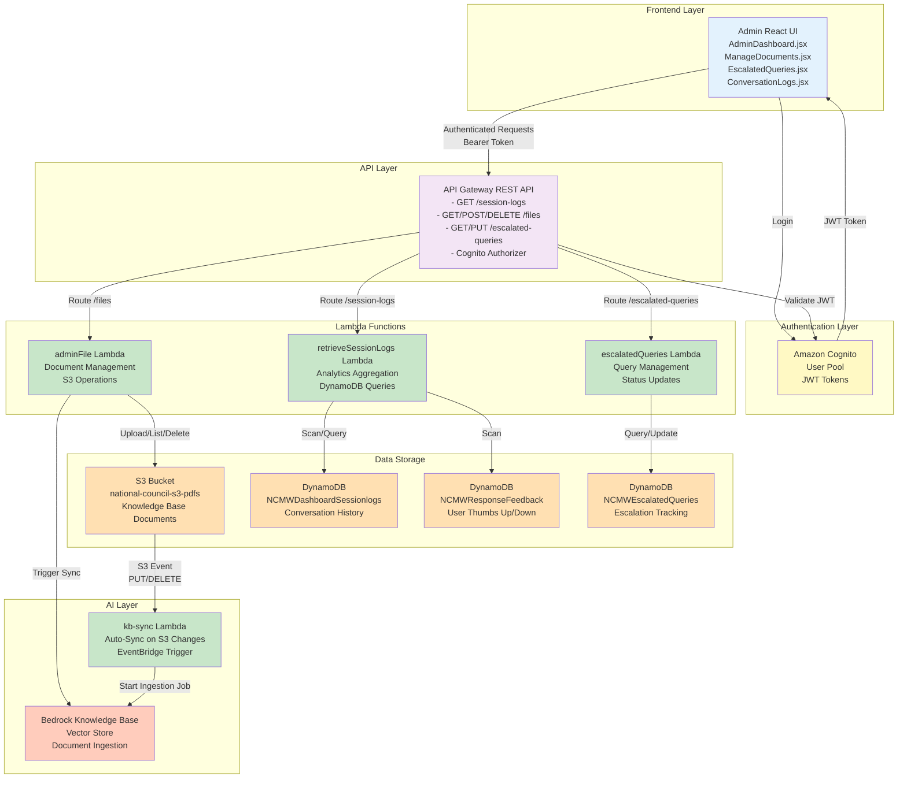
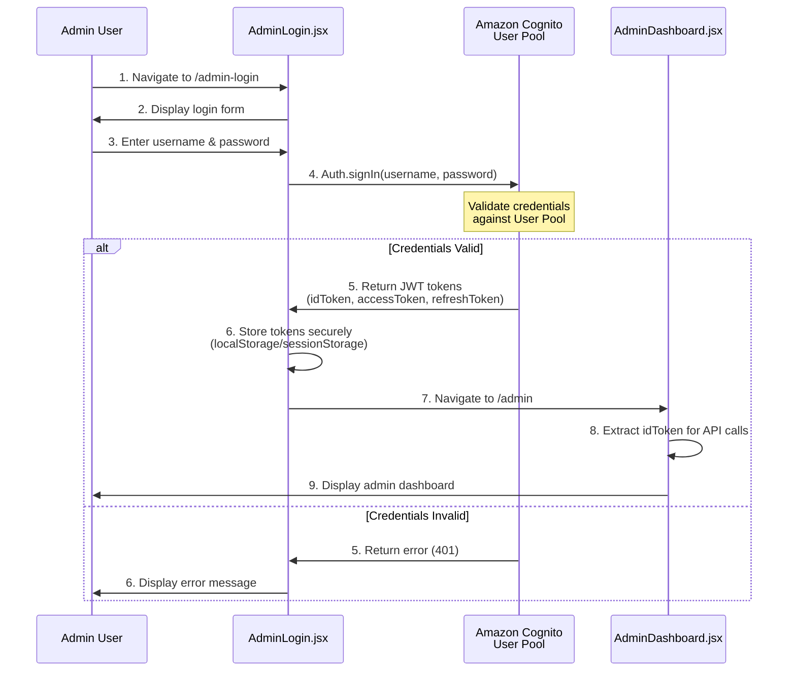
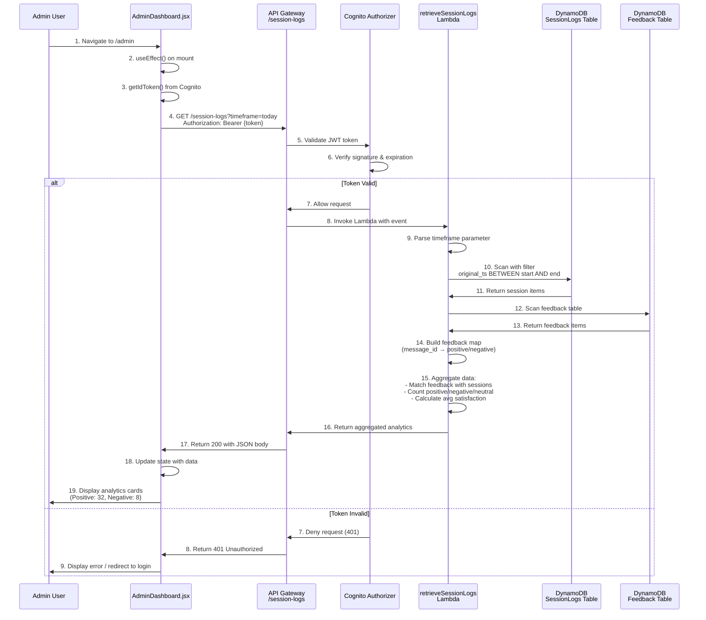
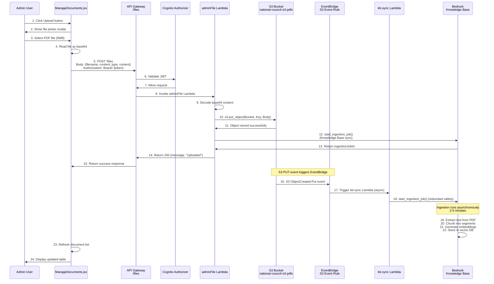
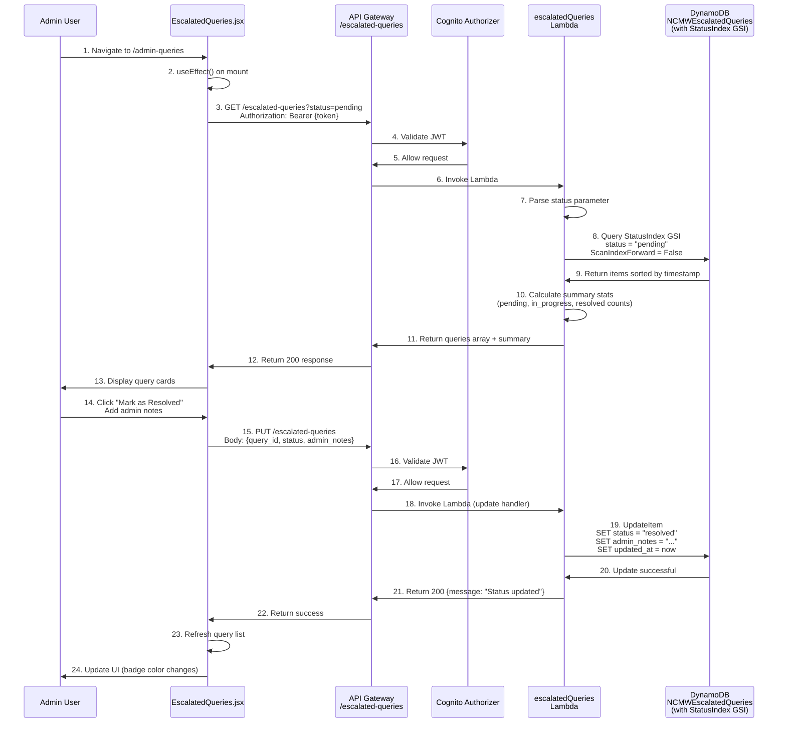
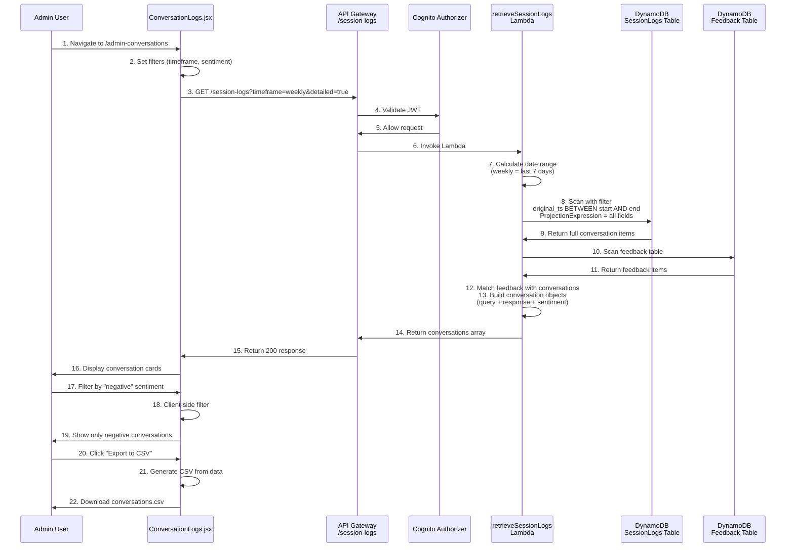
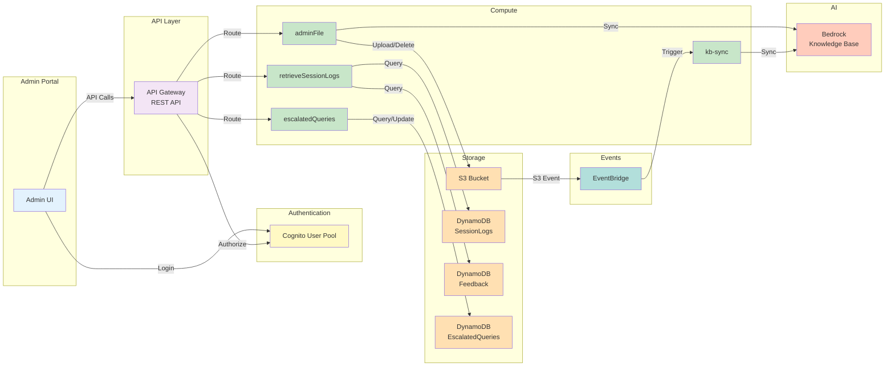

# Admin Portal - AWS Architecture & Flow Diagrams

This document provides comprehensive AWS architecture diagrams, sequence diagrams, and detailed flow breakdowns specifically for the **Admin Portal** of the Learning Navigator application.

---

## Table of Contents

1. [Admin AWS Architecture Overview](#admin-aws-architecture-overview)
2. [Admin Authentication Flow](#admin-authentication-flow)
3. [Dashboard Analytics Flow](#dashboard-analytics-flow)
4. [Document Management Flow](#document-management-flow)
5. [Escalated Queries Management Flow](#escalated-queries-management-flow)
6. [Conversation Logs Flow](#conversation-logs-flow)
7. [Complete Admin Service Map](#complete-admin-service-map)

---

## Admin AWS Architecture Overview

### High-Level Admin Architecture



---

## Admin Authentication Flow

### Sequence Diagram



### Step-by-Step Flow

#### **Step 1: Admin Opens Login Page**
- **URL**: `/admin-login`
- **Component**: [AdminLogin.jsx](../frontend/src/Components/AdminLogin.jsx)
- **Display**: Username and password input fields

#### **Step 2: Admin Submits Credentials**
- **Action**: Click "Sign In" button
- **Frontend Code**:
```javascript
import { Auth } from 'aws-amplify';

const handleLogin = async (username, password) => {
  try {
    const user = await Auth.signIn(username, password);
    // user.signInUserSession contains tokens
    const idToken = user.signInUserSession.idToken.jwtToken;
    navigate('/admin');
  } catch (error) {
    console.error('Login failed:', error);
  }
};
```

#### **Step 3: Cognito Validates Credentials**
- **Service**: Amazon Cognito User Pool
- **Process**:
  1. Hash password using SRP (Secure Remote Password)
  2. Compare against stored password hash
  3. Verify user status (enabled, not locked)
  4. Generate JWT tokens if valid

#### **Step 4: JWT Token Structure**
**ID Token** (used for API authorization):
```json
{
  "sub": "abcd1234-5678-90ef-ghij-klmnopqrstuv",
  "cognito:username": "admin@example.com",
  "email": "admin@example.com",
  "email_verified": true,
  "cognito:groups": ["AdminGroup"],
  "iss": "https://cognito-idp.us-east-1.amazonaws.com/us-east-1_XXXXX",
  "iat": 1704995400,
  "exp": 1705081800
}
```

#### **Step 5: Navigate to Dashboard**
- **Route**: `/admin`
- **Component**: [AdminDashboard.jsx](../frontend/src/Components/AdminDashboard.jsx)
- **Display**: 4 action cards (Documents, Analytics, Queries, Logs)

---

## Dashboard Analytics Flow

### Sequence Diagram



### Step-by-Step Flow

#### **Step 1-3: Dashboard Initialization**
- **Component**: [AdminDashboard.jsx](../frontend/src/Components/AdminDashboard.jsx:31-54)
- **Action**: Component mounts and triggers `fetchAnalytics()`

#### **Step 4: API Request**
```javascript
const token = await getIdToken(); // Extract from Cognito session
const { data } = await axios.get(`${DOCUMENTS_API}session-logs`, {
  params: { timeframe: 'today' },
  headers: { Authorization: `Bearer ${token}` }
});
```

**HTTP Request**:
```http
GET /session-logs?timeframe=today HTTP/1.1
Host: api.example.com
Authorization: Bearer eyJraWQiOiJxxx...
Content-Type: application/json
```

#### **Step 5-7: API Gateway Authorization**
- **Service**: API Gateway Cognito Authorizer
- **Process**:
  1. Extract Bearer token from `Authorization` header
  2. Verify JWT signature using Cognito public keys (JWKS)
  3. Check `exp` claim (expiration time)
  4. Validate `iss` claim (issuer matches Cognito User Pool)
  5. Check `aud` claim (audience matches Client ID)

#### **Step 8: Lambda Invocation Event**
```json
{
  "httpMethod": "GET",
  "path": "/session-logs",
  "queryStringParameters": {
    "timeframe": "today"
  },
  "headers": {
    "Authorization": "Bearer eyJraWQiOiJxxx...",
    "Content-Type": "application/json"
  },
  "requestContext": {
    "authorizer": {
      "claims": {
        "sub": "abcd1234-5678-90ef-ghij-klmnopqrstuv",
        "email": "admin@example.com",
        "cognito:username": "admin@example.com"
      }
    }
  }
}
```

#### **Step 9-11: DynamoDB Session Logs Query**
- **Lambda**: [retrieveSessionLogs](../cdk_backend/lambda/retrieveSessionLogs/handler.py:50-100)
- **Table**: `NCMWDashboardSessionlogs`

**Lambda Code**:
```python
# Calculate time range
now = datetime.utcnow()
start = datetime(now.year, now.month, now.day)  # Today at 00:00
end = now

# Build filter expression
start_iso = start.isoformat()
end_iso = end.isoformat()
filter_exp = Attr("original_ts").between(start_iso, end_iso)

# Scan with projection
response = table.scan(
    FilterExpression=filter_exp,
    ProjectionExpression="session_id, category, sentiment, satisfaction_score, query, response, original_ts"
)
items = response.get("Items", [])
```

**DynamoDB Item Example**:
```json
{
  "session_id": "sess_abc123",
  "original_ts": "2026-01-11T14:32:10Z",
  "query": "How do I become an MHFA instructor?",
  "response": "To become a Mental Health First Aid instructor...",
  "category": "Training Information",
  "satisfaction_score": 85.0,
  "location": "US-East",
  "sentiment": "neutral"
}
```

#### **Step 12-13: DynamoDB Feedback Query**
- **Table**: `NCMWResponseFeedback`

**Lambda Code**:
```python
# Fetch all user feedback (thumbs up/down)
feedback_resp = feedback_table.scan()
feedback_items = feedback_resp.get("Items", [])

# Build feedback map
feedback_map = {}
for fb in feedback_items:
    msg_id = fb.get("message_id")
    feedback_type = fb.get("feedback")  # "positive" or "negative"
    if msg_id and feedback_type:
        feedback_map[msg_id] = feedback_type
```

**Feedback Item Example**:
```json
{
  "message_id": "sess_abc123_1704995530",
  "feedback": "positive",
  "timestamp": "2026-01-11T14:32:10Z",
  "session_id": "sess_abc123"
}
```

#### **Step 14-15: Data Aggregation**
**Lambda Logic**:
```python
feedback_sentiment_counts = {"positive": 0, "negative": 0, "neutral": 0}
satisfaction_scores = []

for item in items:
    # Try to match user feedback
    session_id = item.get("session_id")
    timestamp = item.get("original_ts")
    user_feedback = None

    # Check if user provided feedback (thumbs up/down)
    for msg_id, feedback_type in feedback_map.items():
        if session_id in str(msg_id) or (timestamp and timestamp in str(msg_id)):
            user_feedback = feedback_type
            break

    # Determine sentiment:
    # - positive: User clicked 👍
    # - negative: User clicked 👎
    # - neutral: No feedback
    sentiment = user_feedback if user_feedback else "neutral"

    feedback_sentiment_counts[sentiment] += 1
    satisfaction_scores.append(float(item.get("satisfaction_score", 50)))

avg_satisfaction = sum(satisfaction_scores) / len(satisfaction_scores)
```

#### **Step 16-17: Lambda Response**
```json
{
  "statusCode": 200,
  "headers": {
    "Content-Type": "application/json",
    "Access-Control-Allow-Origin": "*"
  },
  "body": {
    "timeframe": "today",
    "start_date": "2026-01-11",
    "end_date": "2026-01-11",
    "user_count": 45,
    "sentiment": {
      "positive": 32,
      "negative": 8,
      "neutral": 5
    },
    "avg_satisfaction": 78.5,
    "conversations": [...]
  }
}
```

#### **Step 18-19: UI Update**
- **Component**: [AdminDashboard.jsx](../frontend/src/Components/AdminDashboard.jsx:143-185)
- **Display**:
  - **Positive Card**: Green gradient, shows "32" with 😊 icon
  - **Negative Card**: Red gradient, shows "8" with 😞 icon

---

## Document Management Flow

### Sequence Diagram - File Upload



### Step-by-Step Flow - Document Upload

#### **Step 1-3: File Selection**
- **Component**: [ManageDocuments.jsx](../frontend/src/Components/ManageDocuments.jsx:172-209)
- **Action**: Admin clicks upload icon, selects PDF file

#### **Step 4: Base64 Encoding**
```javascript
const handleFileUpload = (e) => {
  const file = e.target.files[0];
  const reader = new FileReader();

  reader.onloadend = async () => {
    const base64 = reader.result.split(",")[1]; // Remove data URL prefix

    // Upload to API
    const token = await getIdToken();
    const res = await fetch(`${DOCUMENTS_API}files`, {
      method: "POST",
      headers: {
        "Content-Type": "application/json",
        "Authorization": `Bearer ${token}`
      },
      body: JSON.stringify({
        filename: file.name,
        content_type: file.type,
        content: base64
      })
    });
  };

  reader.readAsDataURL(file);
};
```

**Request Payload**:
```json
{
  "filename": "mhfa_instructor_guide.pdf",
  "content_type": "application/pdf",
  "content": "JVBERi0xLjQKJeLjz9MKMyAwIG9iago8PC9UeXBlIC9QYWdlCi9QYXJlbnQgMSAwIFIK..."
}
```

#### **Step 5-7: API Gateway Authorization**
- Same JWT validation as analytics flow (Steps 5-7)

#### **Step 8-9: Lambda Receives Upload**
- **Lambda**: [adminFile](../cdk_backend/lambda/adminFile/handler.py:163-175)

**Lambda Handler**:
```python
def handle_upload_file(event):
    body = json.loads(event["body"])
    filename = body.get("filename")
    content_type = body.get("content_type", "application/octet-stream")

    log("UPLOAD filename:", filename)

    # Decode base64 content to bytes
    file_content = b64decode(body["content"])

    return file_content, filename, content_type
```

#### **Step 10-11: S3 Upload**
```python
s3.put_object(
    Bucket=BUCKET_NAME,  # national-council-s3-pdfs
    Key=filename,         # mhfa_instructor_guide.pdf
    Body=file_content,    # Binary PDF data
    ContentType=content_type  # application/pdf
)
```

**S3 Object Metadata**:
```json
{
  "Bucket": "national-council-s3-pdfs",
  "Key": "mhfa_instructor_guide.pdf",
  "Size": 5242880,
  "LastModified": "2026-01-11T14:45:22Z",
  "ContentType": "application/pdf",
  "ETag": "\"d41d8cd98f00b204e9800998ecf8427e\""
}
```

#### **Step 12-13: Knowledge Base Sync**
```python
def sync_knowledge_base():
    response = bedrock_agent.start_ingestion_job(
        knowledgeBaseId=KNOWLEDGE_BASE_ID,
        dataSourceId=DATA_SOURCE_ID
    )

    job_id = response.get("ingestionJobId")
    log("KB sync job id:", job_id)
    return {"status": "success", "jobId": job_id}
```

**Bedrock Response**:
```json
{
  "ingestionJobId": "JOB123ABC",
  "ingestionJobStatus": "STARTING",
  "knowledgeBaseId": "KB1234567890",
  "dataSourceId": "DS0987654321",
  "startedAt": "2026-01-11T14:45:22Z"
}
```

#### **Step 14-15: Success Response**
```json
{
  "statusCode": 200,
  "headers": {
    "Access-Control-Allow-Origin": "*",
    "Access-Control-Allow-Methods": "GET,POST,PUT,DELETE,OPTIONS"
  },
  "body": {
    "message": "Uploaded",
    "file": {
      "name": "mhfa_instructor_guide.pdf",
      "url": "/files/mhfa_instructor_guide.pdf"
    }
  }
}
```

#### **Step 16-18: EventBridge Trigger (Safety Redundancy)**
- **Service**: EventBridge Rule
- **Trigger**: S3 `ObjectCreated:Put` event
- **Target**: `kb-sync` Lambda

**EventBridge Rule Pattern**:
```json
{
  "source": ["aws.s3"],
  "detail-type": ["Object Created"],
  "detail": {
    "bucket": {
      "name": ["national-council-s3-pdfs"]
    }
  }
}
```

#### **Step 19-22: Bedrock Ingestion Process**
1. **PDF Parsing**: Extract text using Apache PDFBox
2. **Chunking**: Split text into 300-token segments with 20% overlap
3. **Embedding**: Generate vectors using `amazon.titan-embed-text-v2`
4. **Indexing**: Store in OpenSearch Serverless vector store

**Ingestion Job Status**:
```bash
# Initial
"ingestionJobStatus": "STARTING"

# After 30 seconds
"ingestionJobStatus": "IN_PROGRESS"

# After 2-5 minutes
"ingestionJobStatus": "COMPLETE"
```

---

## Escalated Queries Management Flow

### Sequence Diagram



### Step-by-Step Flow

#### **Step 1-3: Fetch Escalated Queries**
- **Component**: [EscalatedQueries.jsx](../frontend/src/Components/EscalatedQueries.jsx)

```javascript
const fetchQueries = async () => {
  const token = await getIdToken();
  const { data } = await axios.get(`${DOCUMENTS_API}escalated-queries`, {
    params: { status: 'pending' },
    headers: { Authorization: `Bearer ${token}` }
  });
  setQueries(data.queries);
  setSummary(data.summary);
};
```

#### **Step 4-7: Lambda Receives Request**
- **Lambda**: [escalatedQueries](../cdk_backend/lambda/escalatedQueries/handler.py:37-103)

**Event Payload**:
```json
{
  "httpMethod": "GET",
  "queryStringParameters": {
    "status": "pending",
    "limit": "50"
  },
  "headers": {
    "Authorization": "Bearer eyJraWQiOiJxxx..."
  }
}
```

#### **Step 8-9: DynamoDB Query with GSI**
```python
# Query using Global Secondary Index on "status" attribute
response = table.query(
    IndexName="StatusIndex",
    KeyConditionExpression=Key("status").eq("pending"),
    ScanIndexForward=False,  # Most recent first
    Limit=50
)

items = response.get("Items", [])
```

**DynamoDB Item Structure**:
```json
{
  "query_id": "escalated_sess_xyz789_1704995400",
  "timestamp": "2026-01-11T14:30:00Z",
  "status": "pending",
  "session_id": "sess_xyz789",
  "query": "What is the process for reporting a training incident?",
  "user_email": "instructor@example.com",
  "confidence_score": 35.0,
  "agent_response": "I don't have specific information about...",
  "admin_notes": "",
  "created_at": "2026-01-11T14:30:00Z",
  "updated_at": "2026-01-11T14:30:00Z"
}
```

**DynamoDB Table Schema**:
- **Primary Key**: `query_id` (HASH), `timestamp` (RANGE)
- **GSI**: `StatusIndex` on `status` attribute
- **Attributes**: `session_id`, `query`, `user_email`, `confidence_score`, `status`, `admin_notes`

#### **Step 10-11: Calculate Summary**
```python
# Count queries by status
pending_count = sum(1 for item in items if item.get("status") == "pending")
in_progress_count = sum(1 for item in items if item.get("status") == "in_progress")
resolved_count = sum(1 for item in items if item.get("status") == "resolved")

return {
    "queries": items,
    "summary": {
        "pending": pending_count,
        "in_progress": in_progress_count,
        "resolved": resolved_count
    }
}
```

#### **Step 12-13: Display Query Cards**
- **UI Elements**:
  - **Status Badge**:
    - 🟠 Pending (orange)
    - 🔵 In Progress (blue)
    - 🟢 Resolved (green)
  - **Query Text**: Full user question
  - **User Email**: Contact info
  - **Confidence Score**: Why it was escalated (e.g., 35%)
  - **Admin Notes**: Text area for admin comments
  - **Action Buttons**: "Mark as In Progress", "Mark as Resolved"

#### **Step 14-15: Update Query Status**
```javascript
const updateQueryStatus = async (queryId, timestamp, newStatus, notes) => {
  const token = await getIdToken();
  await axios.put(`${DOCUMENTS_API}escalated-queries`, {
    query_id: queryId,
    timestamp: timestamp,
    status: newStatus,
    admin_notes: notes
  }, {
    headers: { Authorization: `Bearer ${token}` }
  });

  fetchQueries(); // Refresh list
};
```

**PUT Request Body**:
```json
{
  "query_id": "escalated_sess_xyz789_1704995400",
  "timestamp": "2026-01-11T14:30:00Z",
  "status": "resolved",
  "admin_notes": "Responded via email with incident reporting policy document. Attached form HR-301."
}
```

#### **Step 18-19: DynamoDB Update**
- **Lambda**: [escalatedQueries](../cdk_backend/lambda/escalatedQueries/handler.py:110-144)

```python
def handle_update_query_status(event):
    body = json.loads(event.get("body", "{}"))
    query_id = body.get("query_id")
    new_status = body.get("status")
    admin_notes = body.get("admin_notes", "")

    # Update the item in DynamoDB
    table.update_item(
        Key={
            "query_id": query_id,
            "timestamp": body.get("timestamp")
        },
        UpdateExpression="SET #status = :status, admin_notes = :notes, updated_at = :updated",
        ExpressionAttributeNames={
            "#status": "status"  # "status" is a reserved keyword
        },
        ExpressionAttributeValues={
            ":status": new_status,
            ":notes": admin_notes,
            ":updated": datetime.utcnow().isoformat() + "Z"
        }
    )

    return {"message": "Status updated successfully"}
```

---

## Conversation Logs Flow

### Sequence Diagram



### Step-by-Step Flow

#### **Step 1-3: Fetch Conversation Logs**
- **Component**: [ConversationLogs.jsx](../frontend/src/Components/ConversationLogs.jsx)

```javascript
const fetchConversations = async (timeframe = 'today', filters = {}) => {
  const token = await getIdToken();
  const { data } = await axios.get(`${DOCUMENTS_API}session-logs`, {
    params: {
      timeframe: timeframe,
      detailed: 'true'  // Include full query/response text
    },
    headers: { Authorization: `Bearer ${token}` }
  });

  setConversations(data.conversations);
};
```

#### **Step 4-9: Lambda Fetches Detailed Logs**
- Same Lambda as analytics flow, but returns full conversation text

**Projection Expression**:
```python
# Request ALL fields for detailed view
projection = "session_id, location, category, sentiment, satisfaction_score, query, response, original_ts, confidence_score, citations"

response = table.scan(
    FilterExpression=filter_exp,
    ProjectionExpression=projection,
    ExpressionAttributeNames=expr_names
)
```

**Full Conversation Item**:
```json
{
  "session_id": "sess_abc123",
  "original_ts": "2026-01-11T14:32:10Z",
  "query": "How do I become an MHFA instructor? What are the prerequisites and how long does the training take?",
  "response": "To become a Mental Health First Aid instructor, you need to:\n\n1. **Prerequisites:**\n   - Be at least 18 years old\n   - Complete the MHFA 8-hour certification course\n   - Have strong facilitation and public speaking skills\n   - Pass a background check\n\n2. **Training Process:**\n   - Attend a 4-day Instructor Training Course\n   - Complete pre-work assignments (approximately 8 hours)\n   - Pass the final assessment with 80% or higher\n   - Commit to teaching at least 2 courses within the first year\n\n3. **Timeline:**\n   - Application review: 1-2 weeks\n   - Training course: 4 consecutive days\n   - Certification: Issued within 2 weeks after successful completion\n\nFor more information, visit the National Council website or contact instructor.training@mentalhealthfirstaid.org",
  "category": "Training Information",
  "sentiment": "positive",
  "satisfaction_score": 85.0,
  "confidence_score": 92.5,
  "citations": [
    {
      "source": "mhfa_instructor_guide.pdf",
      "page": 12,
      "text": "Prerequisites include completion of MHFA certification..."
    }
  ],
  "location": "US-East"
}
```

#### **Step 10-13: Match with User Feedback**
- Same feedback matching logic as analytics flow
- Sentiment determined by thumbs up/down, not AI

#### **Step 14-16: Display Conversation Cards**
**UI Display** (per conversation):
```
┌─────────────────────────────────────────────────────────┐
│ Session: sess_abc123                  2026-01-11 14:32  │
│ ───────────────────────────────────────────────────────│
│ 😊 Positive  |  Score: 85  |  Training Information     │
│ ───────────────────────────────────────────────────────│
│ Q: How do I become an MHFA instructor?                  │
│                                                          │
│ A: To become a Mental Health First Aid instructor...    │
│                                                          │
│ 📚 Citations: mhfa_instructor_guide.pdf (page 12)       │
└─────────────────────────────────────────────────────────┘
```

#### **Step 17-19: Client-Side Filtering**
```javascript
const filteredConversations = conversations.filter(conv => {
  // Filter by sentiment
  if (filters.sentiment && conv.sentiment !== filters.sentiment) {
    return false;
  }

  // Filter by score range
  if (filters.minScore && conv.satisfaction_score < filters.minScore) {
    return false;
  }

  // Filter by search term
  if (filters.searchTerm) {
    const term = filters.searchTerm.toLowerCase();
    return conv.query.toLowerCase().includes(term) ||
           conv.response.toLowerCase().includes(term);
  }

  return true;
});
```

#### **Step 20-22: Export to CSV**
```javascript
const exportToCSV = () => {
  const csvHeaders = [
    "Session ID",
    "Timestamp",
    "Query",
    "Response",
    "Sentiment",
    "Score",
    "Category"
  ];

  const csvRows = conversations.map(conv => [
    conv.session_id,
    conv.timestamp,
    conv.query,
    conv.response,
    conv.sentiment,
    conv.satisfaction_score,
    conv.category
  ]);

  const csvContent = [
    csvHeaders.join(","),
    ...csvRows.map(row => row.map(cell => `"${cell}"`).join(","))
  ].join("\n");

  const blob = new Blob([csvContent], { type: 'text/csv' });
  const url = URL.createObjectURL(blob);
  const link = document.createElement('a');
  link.href = url;
  link.download = `conversations_${Date.now()}.csv`;
  link.click();
};
```

---

## Complete Admin Service Map

### Lambda Function Details

| Lambda Function | Purpose | API Endpoint | Triggered By | Calls |
|----------------|---------|--------------|--------------|-------|
| **adminFile** | Document management (upload, list, delete, sync) | `/files` (GET, POST, DELETE) | API Gateway | S3, Bedrock Knowledge Base |
| **retrieveSessionLogs** | Analytics aggregation and conversation logs | `/session-logs` (GET) | API Gateway | DynamoDB (SessionLogs, Feedback) |
| **escalatedQueries** | Escalated query management (list, update status) | `/escalated-queries` (GET, PUT) | API Gateway | DynamoDB (EscalatedQueries) |
| **kb-sync** | Automatic Knowledge Base sync on S3 changes | N/A (EventBridge trigger) | S3 events (PUT/DELETE) | Bedrock Knowledge Base |

### DynamoDB Table Details

| Table Name | Primary Key | GSI | Purpose | Updated By |
|------------|-------------|-----|---------|------------|
| **NCMWDashboardSessionlogs** | `session_id` (HASH)<br/>`original_ts` (RANGE) | None | Store conversation history | `chatResponseHandler` Lambda |
| **NCMWResponseFeedback** | `message_id` (HASH) | None | Store user feedback (👍👎) | `responseFeedback` Lambda |
| **NCMWEscalatedQueries** | `query_id` (HASH)<br/>`timestamp` (RANGE) | `StatusIndex` on `status` | Track escalated queries | `email` Lambda (create)<br/>`escalatedQueries` Lambda (update) |
| **NCMWUserProfiles** | `user_id` (HASH) | None | Store user profiles and roles | `userProfile` Lambda |

### API Gateway Endpoints

| Endpoint | Method | Auth | Lambda | Purpose |
|----------|--------|------|--------|---------|
| `/session-logs` | GET | Cognito | `retrieveSessionLogs` | Fetch analytics and conversation logs |
| `/files` | GET | Cognito | `adminFile` | List all documents in S3 bucket |
| `/files` | POST | Cognito | `adminFile` | Upload new document to S3 + trigger KB sync |
| `/files/{key}` | GET | Cognito | `adminFile` | Download specific document |
| `/files/{key}` | DELETE | Cognito | `adminFile` | Delete document from S3 + trigger KB sync |
| `/sync` | POST | Cognito | `adminFile` | Manually trigger Knowledge Base sync |
| `/escalated-queries` | GET | Cognito | `escalatedQueries` | List escalated queries with filters |
| `/escalated-queries` | PUT | Cognito | `escalatedQueries` | Update query status and admin notes |

### AWS Service Integration Map



---

## Performance Metrics

### Typical Response Times

| Operation | Average Latency | Max Latency | Notes |
|-----------|----------------|-------------|-------|
| **Admin Login** | 500-800ms | 1.5s | Cognito SRP protocol |
| **Fetch Analytics** | 800-1500ms | 3s | DynamoDB scan + aggregation |
| **List Documents** | 200-400ms | 800ms | S3 list_objects_v2 |
| **Upload Document (5MB)** | 2-3s | 5s | Base64 encoding + S3 upload |
| **Delete Document** | 300-500ms | 1s | S3 delete_object + KB sync trigger |
| **List Escalated Queries** | 400-700ms | 1.5s | DynamoDB query with GSI |
| **Update Query Status** | 300-500ms | 1s | DynamoDB update_item |
| **Fetch Conversation Logs** | 1-2s | 4s | DynamoDB scan + feedback matching |
| **Knowledge Base Ingestion** | 2-5 minutes | 10 minutes | Async process (PDF parsing + embeddings) |

### Cost Optimization Tips

1. **DynamoDB**: Use GSI for status queries instead of table scans
2. **S3**: Enable S3 Transfer Acceleration for large file uploads
3. **Lambda**: Use provisioned concurrency for `retrieveSessionLogs` during peak hours
4. **API Gateway**: Enable caching for analytics endpoint (TTL: 5 minutes)
5. **Bedrock**: Batch document ingestion instead of per-file triggers

---

## Security Best Practices

### 1. Authentication & Authorization
- ✅ Cognito User Pool with MFA enabled
- ✅ JWT token expiration (1 hour)
- ✅ API Gateway Cognito authorizer on all endpoints
- ✅ IAM roles with least-privilege access

### 2. Data Protection
- ✅ S3 bucket encryption (AES-256)
- ✅ DynamoDB encryption at rest
- ✅ HTTPS only (TLS 1.2+)
- ✅ No plaintext credentials in code

### 3. Access Control
- ✅ Admin-only API endpoints
- ✅ Cognito group-based authorization
- ✅ S3 bucket policies (deny public access)
- ✅ VPC endpoints for DynamoDB (optional)

### 4. Audit & Monitoring
- ✅ CloudWatch Logs for all Lambda functions
- ✅ CloudTrail for API Gateway access logs
- ✅ DynamoDB point-in-time recovery enabled
- ✅ SNS alerts for failed Lambda invocations

---

## Related Documentation

- [User Flow Steps](USER_FLOW_STEPS.md) - User perspective (non-admin) flow
- [Admin Flow Steps](ADMIN_FLOW_STEPS.md) - Detailed step-by-step admin workflows
- [AWS Architecture](AWS_ARCHITECTURE.md) - Complete system architecture
- [Admin Features](features/ADMIN_FEATURES.md) - Feature descriptions

---

**Date**: January 11, 2026
**Status**: ✅ Complete - All admin AWS architecture documented
**Diagrams**: 6 Mermaid diagrams (architecture, sequences)
**Flows**: 5 detailed flows with step-by-step breakdowns
