# MHFA Learning Navigator - AWS Architecture Documentation

## Overview

The MHFA Learning Navigator is a comprehensive AI-powered chatbot system built on AWS using Bedrock Agent, Lambda functions, DynamoDB, S3, API Gateway, Cognito, and Amplify. This document provides detailed architecture diagrams and explanations of all components.

---

## 1. Main AWS Architecture Diagram

```mermaid
graph TB
    subgraph "Frontend - AWS Amplify"
        UI[React Web Application]
        UI --> |HTTPS| WS[WebSocket Connection]
        UI --> |HTTPS| AdminAPI[REST API Gateway]
    end

    subgraph "WebSocket Real-time Communication"
        WS --> |WSS| APIGW[API Gateway WebSocket]
        APIGW --> |sendMessage| WSHandler[websocketHandler Lambda]
        WSHandler --> |Async Invoke| CFEval[chatResponseHandler Lambda]
        CFEval --> |Send Response| APIGW
    end

    subgraph "Amazon Bedrock - AI Services"
        CFEval --> |invoke_agent| Agent[Bedrock Agent<br/>Learning Navigator]
        Agent --> |Query| KB[Knowledge Base<br/>Vector Search]
        Agent --> |Content Filter| Guard[Guardrails]
        Agent --> |notify-admin| NotifyFn[email Lambda]
        KB --> |Embeddings| Titan[Titan Embed v2<br/>1024 dimensions]
        Agent --> |LLM| Sonnet4[Claude 4 Sonnet<br/>Cross-Region Inference]
    end

    subgraph "Knowledge Base Storage"
        KB --> |RAG Query| S3KB[(S3 Bucket<br/>national-council-s3-pdfs)]
        KB --> |Multimodal Data| S3Supp[(S3 Supplemental<br/>Extracted Content)]
        S3KB --> |PUT/DELETE Events| KBSync[kb-sync Lambda]
        KBSync --> |StartIngestionJob| KB
    end

    subgraph "Admin REST API - API Gateway"
        AdminAPI --> CogAuth[Cognito Authorizer]
        CogAuth --> |Authenticated| AdminRoutes{API Routes}
        AdminRoutes --> |GET/POST /files| FileHandler[adminFile Lambda]
        AdminRoutes --> |GET /session-logs| AnalyticsHandler[retrieveSessionLogs Lambda]
        AdminRoutes --> |GET /escalated-queries| EscalatedHandler[escalatedQueries Lambda]
    end

    subgraph "Authentication & Authorization"
        UI --> |Login| CogPool[Cognito User Pool]
        CogPool --> |Identity| CogIdentity[Cognito Identity Pool]
        CogIdentity --> |STS AssumeRole| AuthRole[Authenticated IAM Role]
        AuthRole --> |S3 Permissions| S3KB
    end

    subgraph "Data Storage - DynamoDB"
        CFEval --> |Classify & Log| LogClass[logclassifier Lambda]
        LogClass --> |AI Sentiment| Nova[Amazon Nova Lite]
        LogClass --> |Write| SessionTable[(DynamoDB<br/>NCMWDashboardSessionlogs)]
        NotifyFn --> |Write| EscalatedTable[(DynamoDB<br/>NCMWEscalatedQueries)]
        UI --> |Thumbs Up/Down| FeedbackAPI[/feedback endpoint]
        FeedbackAPI --> FeedbackFn[feedback Lambda]
        FeedbackFn --> |Write| FeedbackTable[(DynamoDB<br/>NCMWResponseFeedback)]
        AnalyticsHandler --> |Read| SessionTable
        AnalyticsHandler --> |Read| FeedbackTable
        EscalatedHandler --> |Read/Update| EscalatedTable
        SessionLogsFn[sessionLogs Lambda] --> |Write| SessionTable
        ProfileFn[userProfile Lambda] --> |Read/Write| ProfileTable[(DynamoDB<br/>NCMWUserProfiles)]
    end

    subgraph "Email Processing"
        SES[Amazon SES] --> |Receipt Rule| EmailBucket[(S3 Email Bucket)]
        SES --> |Trigger| EmailReply[emailReply Lambda]
        EmailReply --> |Process & Upload| S3KB
        EmailReply --> |Sync KB| KB
        NotifyFn --> |Send Email| SES
    end

    subgraph "Scheduled Jobs"
        EventBridge[EventBridge Daily Rule<br/>11:59 PM UTC] --> |Trigger| SessionLogsFn
        SessionLogsFn --> |Query| CWLogs[CloudWatch Logs<br/>chatResponseHandler logs]
    end

    subgraph "Monitoring & Logging"
        CFEval -.->|Logs| CWLogs
        WSHandler -.->|Logs| CWLogs2[CloudWatch Logs]
        LogClass -.->|Logs| CWLogs3[CloudWatch Logs]
        KBSync -.->|Logs| CWLogs4[CloudWatch Logs]
    end

    style Agent fill:#FF9900,stroke:#232F3E,stroke-width:3px
    style KB fill:#FF9900,stroke:#232F3E,stroke-width:3px
    style Sonnet4 fill:#FF9900,stroke:#232F3E,stroke-width:3px
    style UI fill:#FF6B6B,stroke:#232F3E,stroke-width:2px
    style SessionTable fill:#4A90E2,stroke:#232F3E,stroke-width:2px
    style FeedbackTable fill:#4A90E2,stroke:#232F3E,stroke-width:2px
    style EscalatedTable fill:#4A90E2,stroke:#232F3E,stroke-width:2px
    style S3KB fill:#50C878,stroke:#232F3E,stroke-width:2px
```

---

## 2. User Flow Diagram

This diagram shows the end-user journey through the chatbot interface.


---

## 3. Admin Flow Diagram

This diagram shows the administrator's journey through the admin dashboard.

```mermaid
sequenceDiagram
    participant Admin as 👨‍💼 Admin User
    participant UI as Admin Dashboard<br/>(React)
    participant Cog as Cognito
    participant API as Admin REST API
    participant Auth as Cognito Authorizer
    participant RSL as retrieveSessionLogs
    participant EQ as escalatedQueries
    participant AF as adminFile
    participant KB as Knowledge Base
    participant KBS as kb-sync
    participant DDB as DynamoDB Tables

    Note over Admin,UI: Admin Authentication

    Admin->>UI: 1. Navigate to /admin-login
    UI->>Cog: 2. Initiate login (Cognito Hosted UI)
    Cog-->>Admin: 3. Show login page
    Admin->>Cog: 4. Enter credentials
    Cog->>Cog: 5. Validate user
    Cog-->>UI: 6. Return JWT tokens (ID + Access)
    UI->>UI: 7. Store tokens in localStorage
    UI-->>Admin: Redirect to /admin-dashboard

    Note over Admin,RSL: View Analytics

    Admin->>UI: 8. View dashboard (today's data)
    UI->>API: 9. GET /session-logs?timeframe=today<br/>(JWT in Authorization header)
    API->>Auth: 10. Validate JWT token
    Auth->>Cog: 11. Verify with Cognito User Pool
    Cog-->>Auth: Token valid
    Auth-->>API: Authorized
    API->>RSL: 12. Invoke retrieveSessionLogs
    RSL->>DDB: 13. Scan NCMWDashboardSessionlogs
    RSL->>DDB: 14. Scan NCMWResponseFeedback
    RSL->>RSL: 15. Match feedback to conversations<br/>Calculate sentiment (👍/👎/neutral)
    RSL-->>API: 16. Return analytics:<br/>- User count<br/>- Sentiment breakdown<br/>- Top categories<br/>- Recent conversations
    API-->>UI: JSON response
    UI-->>Admin: Display dashboard with charts

    Note over Admin,UI: Change Timeframe

    Admin->>UI: 17. Select "Weekly" filter
    UI->>API: 18. GET /session-logs?timeframe=weekly
    API->>RSL: Repeat steps 10-16
    RSL-->>UI: Updated analytics for past week
    UI-->>Admin: Refresh dashboard

    Note over Admin,EQ: Manage Escalated Queries

    Admin->>UI: 19. Click "Escalated Queries" tab
    UI->>API: 20. GET /escalated-queries?status=pending
    API->>Auth: Validate JWT
    API->>EQ: 21. Invoke escalatedQueries Lambda
    EQ->>DDB: 22. Query NCMWEscalatedQueries<br/>(StatusIndex)
    EQ-->>UI: Return pending queries with:<br/>- Query text<br/>- User email<br/>- Agent response<br/>- Timestamp
    UI-->>Admin: Display list of pending queries

    Admin->>UI: 23. Mark query as "resolved"
    UI->>API: 24. PUT /escalated-queries<br/>(query_id, status: "resolved", notes)
    API->>EQ: Update status
    EQ->>DDB: 25. Update item in NCMWEscalatedQueries
    EQ-->>UI: Status updated
    UI-->>Admin: Show success message

    Note over Admin,AF: Manage Documents

    Admin->>UI: 26. Click "Manage Documents"
    UI->>API: 27. GET /files (list all PDFs)
    API->>Auth: Validate JWT
    API->>AF: 28. Invoke adminFile Lambda
    AF->>KB: 29. List objects in S3 bucket
    KB-->>AF: Return file list with metadata
    AF-->>UI: JSON array of files
    UI-->>Admin: Display document list

    Admin->>UI: 30. Upload new PDF file
    UI->>UI: 31. Select file from local system
    UI->>API: 32. POST /files<br/>(Base64 encoded file + metadata)
    API->>AF: Forward upload request
    AF->>KB: 33. PutObject to S3 bucket
    KB-->>KBS: 34. S3 Event (OBJECT_CREATED) triggers kb-sync
    KBS->>KBS: 35. Start Bedrock ingestion job
    KBS-->>KB: Knowledge Base re-indexing (2-5 min)
    AF-->>UI: Upload successful
    UI-->>Admin: "File uploaded. KB syncing..."

    Admin->>UI: 36. Delete old document
    UI->>API: 37. DELETE /files/{filename}
    API->>AF: Forward delete request
    AF->>KB: 38. DeleteObject from S3
    KB-->>KBS: 39. S3 Event (OBJECT_REMOVED) triggers kb-sync
    KBS->>KBS: 40. Start Bedrock ingestion job
    AF-->>UI: Delete successful
    UI-->>Admin: "File deleted. KB syncing..."

    Note over Admin,UI: Manual KB Sync

    Admin->>UI: 41. Click "Sync Now" button
    UI->>API: 42. POST /sync
    API->>AF: Trigger manual sync
    AF->>KB: 43. StartIngestionJob API call
    KB-->>AF: Ingestion job started
    AF-->>UI: Sync initiated
    UI-->>Admin: "Knowledge Base syncing..."

    Note over Admin,UI: View Conversation Logs

    Admin->>UI: 44. Click "Conversation Logs"
    UI->>API: 45. GET /session-logs (all conversations)
    API->>RSL: Invoke with full detail flag
    RSL->>DDB: Query all sessions
    RSL-->>UI: Return detailed conversation logs
    UI-->>Admin: Display:<br/>- Query/response pairs<br/>- Sentiment tags (👍/👎/neutral)<br/>- Categories<br/>- Timestamps

    Admin->>UI: 46. Filter by sentiment "Negative"
    UI->>UI: 47. Client-side filter (no API call)
    UI-->>Admin: Show only negative feedback conversations

    Note over Admin,UI: Logout

    Admin->>UI: 48. Click "Logout" button
    UI->>Cog: 49. Revoke session (optional)
    UI->>UI: 50. Clear tokens from localStorage
    UI-->>Admin: Redirect to login page
```



---

## 4. Lambda Functions Reference

### Core Functions

| Function Name | Purpose | Trigger | Key Services Used |
|--------------|---------|---------|-------------------|
| **websocketHandler** | Handles WebSocket connections and routes messages | API Gateway WebSocket | Lambda, chatResponseHandler |
| **chatResponseHandler** | Main chatbot logic - invokes Bedrock Agent and streams responses | websocketHandler (async) | Bedrock Agent, API Gateway, logclassifier |
| **logclassifier** | Classifies queries into categories and analyzes sentiment using AI | chatResponseHandler (async) | Bedrock (Nova Lite), DynamoDB |
| **email** (NotifyAdminFn) | Sends admin email notifications for escalated queries | Bedrock Agent action group | SES, DynamoDB (EscalatedQueries) |
| **feedback** | Handles user thumbs up/down feedback | API Gateway POST /feedback | DynamoDB (ResponseFeedback) |
| **kb-sync** | Auto-syncs Knowledge Base when S3 documents change | S3 Events (PUT/DELETE) | Bedrock Agent, S3 |

### Admin API Functions

| Function Name | Purpose | Trigger | Key Services Used |
|--------------|---------|---------|-------------------|
| **adminFile** | Manages PDF uploads, downloads, and deletions | API Gateway (GET/POST/DELETE /files) | S3, Bedrock Agent |
| **retrieveSessionLogs** | Retrieves analytics data and conversation logs | API Gateway (GET /session-logs) | DynamoDB (SessionLogs, Feedback) |
| **escalatedQueries** | Lists and manages escalated user queries | API Gateway (GET/PUT /escalated-queries) | DynamoDB (EscalatedQueries) |
| **userProfile** | Manages user profiles and personalized recommendations | API Gateway (GET/POST/PUT /user-profile) | DynamoDB (UserProfiles), Cognito |

### Supporting Functions

| Function Name | Purpose | Trigger | Key Services Used |
|--------------|---------|---------|-------------------|
| **sessionLogs** | Daily batch job to aggregate conversation data | EventBridge (11:59 PM UTC daily) | CloudWatch Logs, S3, DynamoDB |
| **emailReply** | Processes admin email replies to escalated queries | SES Receipt Rule | SES, S3, Knowledge Base |

---

## 5. AWS Services Summary

### Core Services

- **Amazon Bedrock Agent**: AI orchestration with Claude 4 Sonnet
- **Amazon Bedrock Knowledge Base**: Vector search with Titan Embeddings
- **AWS Lambda**: 12 serverless functions for backend logic
- **Amazon DynamoDB**: 4 tables for session logs, feedback, escalated queries, and user profiles
- **Amazon S3**: 3 buckets for documents, emails, and supplemental data
- **Amazon API Gateway**: WebSocket and REST APIs
- **Amazon Cognito**: User authentication and authorization
- **AWS Amplify**: Frontend hosting and deployment

### Supporting Services

- **Amazon SES**: Email sending and receiving
- **Amazon EventBridge**: Scheduled job triggers
- **Amazon CloudWatch**: Logs and monitoring
- **AWS Secrets Manager**: GitHub token storage
- **AWS IAM**: Roles and permissions

---

## 6. Data Flow Summary

### User Query Flow
1. User sends query via WebSocket
2. websocketHandler receives and forwards to chatResponseHandler
3. chatResponseHandler invokes Bedrock Agent with query
4. Agent queries Knowledge Base (vector search)
5. Agent generates response using Claude 4 Sonnet
6. Response streamed back to user via WebSocket
7. logclassifier analyzes and stores conversation metadata

### Feedback Flow
1. User clicks thumbs up/down
2. Frontend calls /feedback endpoint
3. feedback Lambda stores in DynamoDB
4. Admin dashboard aggregates feedback for analytics

### Escalation Flow
1. Agent detects low confidence (<90%)
2. Agent requests user email
3. Agent triggers notify-admin action
4. email Lambda sends notification and stores in DynamoDB
5. Admin views in "Escalated Queries" dashboard
6. Admin updates status to "resolved" when handled

### Document Management Flow
1. Admin uploads PDF via dashboard
2. adminFile Lambda uploads to S3
3. S3 event triggers kb-sync Lambda
4. kb-sync starts Bedrock ingestion job
5. Knowledge Base re-indexes (2-5 minutes)
6. Updated information available to chatbot

---

## 7. Security Features

- **Authentication**: Cognito User Pool with JWT tokens
- **Authorization**: Cognito authorizer on all admin endpoints
- **Encryption**: SSL/TLS enforced on all S3 buckets
- **Content Filtering**: Bedrock Guardrails with HIGH input filtering
- **CORS**: Configured on all API endpoints
- **IAM**: Least-privilege roles for all Lambda functions
- **Secrets**: GitHub token stored in Secrets Manager

---

## 8. High Availability & Scalability

- **Lambda**: Auto-scales to handle concurrent requests
- **DynamoDB**: On-demand capacity for automatic scaling
- **S3**: 99.999999999% durability, auto-scaling
- **Bedrock**: Cross-Region Inference Profile for high availability
- **API Gateway**: Fully managed, auto-scaling
- **Amplify**: Global CDN for frontend assets

---

## 9. Monitoring & Observability

- **CloudWatch Logs**: All Lambda functions log to CloudWatch
- **EventBridge**: Daily job for session log aggregation
- **Admin Dashboard**: Real-time analytics and conversation monitoring
- **Sentiment Tracking**: User feedback (thumbs up/down) tracked per conversation
- **Escalated Queries**: Admin notification system for low-confidence responses

---

## 10. Cost Optimization

- **Lambda**: Pay-per-invocation with 120s timeout
- **DynamoDB**: On-demand billing mode
- **S3**: Lifecycle policies for old logs (RETAIN policy)
- **Bedrock**: Cross-region inference for cost efficiency
- **Amplify**: Automatic caching with CDN

---

*This architecture documentation is maintained as part of the MHFA Learning Navigator project.*
*Last Updated: January 11, 2026*
