# Learning Navigator - Simple High-Level Architecture

This document provides simple, easy-to-understand architecture diagrams for the Learning Navigator chatbot application.

---

## Table of Contents

1. [Complete System Overview](#complete-system-overview)
2. [User Chat Flow (Simple)](#user-chat-flow-simple)
3. [Admin Portal Flow (Simple)](#admin-portal-flow-simple)
4. [Data Flow Diagram](#data-flow-diagram)
5. [Service Layer View](#service-layer-view)

---

## Complete System Overview

### One-Page Architecture

```mermaid
graph TB
    subgraph "👥 Users"
        GuestUser[Guest Users<br/>No Login Required]
        AdminUser[Admin Users<br/>Login Required]
    end

    subgraph "🌐 Frontend - AWS Amplify"
        ChatUI[Chat Interface<br/>React App]
        AdminUI[Admin Dashboard<br/>React App]
    end

    subgraph "🔐 Authentication"
        Cognito[Amazon Cognito<br/>Admin Login Only]
    end

    subgraph "🚪 API Gateway"
        WebSocket[WebSocket API<br/>Real-Time Chat]
        RestAPI[REST API<br/>Admin Operations]
    end

    subgraph "⚡ Lambda Functions"
        ChatLambda[Chat Handler<br/>Process Messages]
        AdminLambda[Admin Handler<br/>Manage Documents]
        LoggingLambda[Logger<br/>Track Conversations]
    end

    subgraph "🤖 AI Services - Amazon Bedrock"
        Agent[Bedrock Agent<br/>Claude 3.5 Sonnet]
        KB[Knowledge Base<br/>Vector Search]
    end

    subgraph "💾 Data Storage"
        S3[S3 Bucket<br/>PDF Documents]
        DynamoDB[DynamoDB<br/>Logs & Feedback]
    end

    subgraph "📧 Notifications"
        SES[Amazon SES<br/>Email Alerts]
    end

    GuestUser -->|Chat| ChatUI
    AdminUser -->|Login| Cognito
    AdminUser -->|Manage| AdminUI

    ChatUI -->|WebSocket| WebSocket
    AdminUI -->|HTTPS| RestAPI

    WebSocket --> ChatLambda
    RestAPI --> AdminLambda

    ChatLambda -->|Ask Question| Agent
    ChatLambda -->|Log| LoggingLambda
    ChatLambda -->|Low Confidence| SES

    Agent -->|Search| KB
    KB -->|Read| S3

    AdminLambda -->|Upload/Delete| S3
    LoggingLambda -->|Store| DynamoDB

    Cognito -.->|Authorize| RestAPI

    style GuestUser fill:#E3F2FD
    style AdminUser fill:#E3F2FD
    style ChatUI fill:#E1F5FE
    style AdminUI fill:#E1F5FE
    style Cognito fill:#FFF9C4
    style WebSocket fill:#F3E5F5
    style RestAPI fill:#F3E5F5
    style ChatLambda fill:#C8E6C9
    style AdminLambda fill:#C8E6C9
    style LoggingLambda fill:#C8E6C9
    style Agent fill:#FFCCBC
    style KB fill:#FFCCBC
    style S3 fill:#FFE0B2
    style DynamoDB fill:#FFE0B2
    style SES fill:#FFF59D
```



---

## User Chat Flow (Simple)

### Happy Path - User Asks Question

```mermaid
sequenceDiagram
    participant User as 👤 Guest User
    participant Chat as 💬 Chat Interface
    participant Lambda as ⚡ Chat Lambda
    participant AI as 🤖 Bedrock Agent
    participant Docs as 📄 Knowledge Base

    User->>Chat: 1. Type question:<br/>"How do I become an instructor?"
    Chat->>Lambda: 2. Send via WebSocket
    Lambda->>AI: 3. Process with AI
    AI->>Docs: 4. Search PDF documents
    Docs->>AI: 5. Return relevant info
    AI->>Lambda: 6. Generate answer
    Lambda->>Chat: 7. Stream response
    Chat->>User: 8. Display answer + sources

    Note over User,Chat: ✅ High confidence (90%+)<br/>User gets immediate answer
```



### Low Confidence Path - Expert Needed

```mermaid
sequenceDiagram
    participant User as 👤 Guest User
    participant Chat as 💬 Chat Interface
    participant Lambda as ⚡ Chat Lambda
    participant AI as 🤖 Bedrock Agent
    participant Email as 📧 Email Service
    participant Admin as 👨‍💼 Admin

    User->>Chat: 1. Ask difficult question
    Chat->>Lambda: 2. Send message
    Lambda->>AI: 3. Try to answer
    AI->>Lambda: 4. Low confidence (<90%)
    Lambda->>Chat: 5. Ask for user email
    Chat->>User: 6. Show email input
    User->>Chat: 7. Enter email
    Chat->>Lambda: 8. Submit email
    Lambda->>Email: 9. Notify admin
    Email->>Admin: 10. Send notification

    Note over Admin: Admin researches<br/>and emails user directly

    Admin->>User: 11. Email detailed answer
```



---

## Admin Portal Flow (Simple)

### Admin Workflow


---

## Data Flow Diagram

### How Information Flows Through the System

```mermaid
flowchart LR
    subgraph Input
        A[👤 User Question]
    end

    subgraph Processing
        B[⚡ Lambda Function]
        C[🤖 AI Agent]
        D[📚 Knowledge Base]
    end

    subgraph Storage
        E[(📄 S3<br/>PDF Files)]
        F[(💾 DynamoDB<br/>Conversations)]
    end

    subgraph Output
        G[💬 AI Response]
        H[📊 Analytics]
        I[📧 Email Alert]
    end

    A -->|WebSocket| B
    B -->|Invoke| C
    C -->|Search| D
    D -->|Read| E

    C -->|Generate| G
    B -->|Log| F
    F -->|Display| H

    C -.->|If Low Confidence| I

    style A fill:#E3F2FD
    style B fill:#C8E6C9
    style C fill:#FFCCBC
    style D fill:#FFCCBC
    style E fill:#FFE0B2
    style F fill:#FFE0B2
    style G fill:#E1F5FE
    style H fill:#E1F5FE
    style I fill:#FFF59D
```



---

## Service Layer View

### AWS Services by Category


---

## Component Summary

### Frontend Components

| Component | Technology | Purpose |
|-----------|-----------|---------|
| **Chat Interface** | React + Material-UI | User asks questions, views responses |
| **Admin Dashboard** | React + Material-UI | Manage documents, view analytics |
| **Hosting** | AWS Amplify | Serves React application |

### Backend Services

| Service | Type | Purpose |
|---------|------|---------|
| **WebSocket API** | API Gateway | Real-time chat communication |
| **REST API** | API Gateway | Admin operations (CRUD) |
| **Chat Handler** | Lambda Function | Process user questions |
| **Admin Handler** | Lambda Function | Document management |
| **Logger** | Lambda Function | Save conversations |
| **Bedrock Agent** | AI Service | Generate intelligent responses |
| **Knowledge Base** | AI Service | Search PDF documents |

### Data Storage

| Storage | Type | Contains |
|---------|------|----------|
| **S3 Bucket** | Object Storage | PDF training documents |
| **DynamoDB - SessionLogs** | NoSQL Database | Conversation history |
| **DynamoDB - Feedback** | NoSQL Database | User thumbs up/down |
| **DynamoDB - EscalatedQueries** | NoSQL Database | Questions needing expert help |
| **DynamoDB - UserProfiles** | NoSQL Database | User roles & preferences |

---

## Key Features at a Glance

### 1. 💬 Guest Chat (No Login)
- Users ask questions without creating account
- AI responds with answers from training documents
- Responses include source citations (PDF page numbers)

### 2. 🎯 Confidence-Based Routing
- **High Confidence (≥90%)**: Direct answer from AI
- **Low Confidence (<90%)**: Route to human expert via email

### 3. 👍 User Feedback
- Thumbs up/down on each response
- Helps improve answer quality
- Tracked in admin analytics

### 4. 👨‍💼 Admin Portal
- **Analytics**: View usage stats and sentiment
- **Documents**: Upload/delete PDF training materials
- **Queries**: Manage questions needing expert help
- **Logs**: Review conversation history

### 5. 🔄 Auto-Sync Knowledge Base
- Upload PDF → Automatically indexed by AI
- No manual sync required
- Ready for queries in 2-5 minutes

---

## Request Flow Examples

### Example 1: Simple Question

```
User: "How long is the MHFA course?"
  ↓
WebSocket API
  ↓
Chat Lambda
  ↓
Bedrock Agent → Knowledge Base → S3 PDFs
  ↓
Lambda receives: "The MHFA course is 8 hours..."
Confidence: 95%
  ↓
Stream back to user via WebSocket
  ↓
User sees answer + citation
```

### Example 2: Complex Question (Escalation)

```
User: "What's the incident reporting process?"
  ↓
WebSocket API
  ↓
Chat Lambda
  ↓
Bedrock Agent → Knowledge Base → S3 PDFs
  ↓
No matching documents found
Confidence: 35%
  ↓
Lambda requests user email
  ↓
User provides: user@example.com
  ↓
Email Lambda → SES → Admin notification
  ↓
Admin researches and emails user directly
```

### Example 3: Admin Uploads Document

```
Admin: Upload "new_training_guide.pdf"
  ↓
Login via Cognito
  ↓
REST API (authenticated)
  ↓
Admin Lambda
  ↓
Upload to S3 bucket
  ↓
Trigger Knowledge Base sync
  ↓
Bedrock ingests PDF (2-5 min)
  ↓
Document ready for user queries
```

---

## Technology Stack

### AWS Services Used

| Category | Services |
|----------|----------|
| **Hosting** | AWS Amplify |
| **Auth** | Amazon Cognito |
| **API** | API Gateway (WebSocket + REST) |
| **Compute** | AWS Lambda (Python 3.12) |
| **AI** | Amazon Bedrock (Claude 3.5 Sonnet, Knowledge Base) |
| **Storage** | Amazon S3, DynamoDB |
| **Email** | Amazon SES |
| **Monitoring** | CloudWatch, X-Ray |

### Frontend Stack

| Technology | Purpose |
|-----------|---------|
| **React 18** | UI framework |
| **Material-UI** | Component library |
| **Axios** | HTTP client |
| **WebSocket API** | Real-time communication |

### Backend Stack

| Technology | Purpose |
|-----------|---------|
| **Python 3.12** | Lambda runtime |
| **boto3** | AWS SDK |
| **CDK (TypeScript)** | Infrastructure as Code |

---

## Deployment Model

```mermaid
graph LR
    subgraph "Development"
        Dev[👨‍💻 Developer<br/>Local Code]
    end

    subgraph "Source Control"
        Git[📦 GitHub<br/>Repository]
    end

    subgraph "CI/CD"
        CodeBuild[🔨 AWS CodeBuild<br/>Build & Deploy]
    end

    subgraph "Infrastructure"
        CDK[☁️ AWS CDK<br/>Deploy Stack]
    end

    subgraph "Production"
        AWS[🚀 AWS Services<br/>Live Application]
    end

    Dev -->|Push| Git
    Git -->|Trigger| CodeBuild
    CodeBuild -->|Deploy via| CDK
    CDK -->|Provision| AWS

    style Dev fill:#E3F2FD
    style Git fill:#E1F5FE
    style CodeBuild fill:#C8E6C9
    style CDK fill:#FFCCBC
    style AWS fill:#FFE0B2
```



---

## Cost Overview (Simplified)

### Monthly Cost Estimate
**Assumptions**: 10,000 conversations/month

| Service | Estimated Cost |
|---------|----------------|
| **Bedrock (AI)** | $15-20 |
| **Lambda** | $2-5 |
| **API Gateway** | $0.50-1 |
| **DynamoDB** | $1-2 |
| **S3** | $2-3 |
| **Other** | $1-2 |
| **Total** | **~$25-35/month** |

💡 **Cost Optimization**: Most services are pay-per-use with generous free tiers.

---

## Security Highlights

### ✅ Security Features

1. **Guest Chat**: No login required, but no PII stored
2. **Admin Access**: Cognito authentication with JWT tokens
3. **Data Encryption**: All data encrypted at rest (S3, DynamoDB)
4. **Secure Transport**: TLS 1.2+ for all connections
5. **IAM Roles**: Least-privilege access for Lambda functions
6. **Rate Limiting**: API Gateway throttling enabled

---

## Scalability

### Auto-Scaling Components

| Component | Scaling Method |
|-----------|----------------|
| **Lambda** | Auto-scales to 1000+ concurrent |
| **DynamoDB** | On-demand (unlimited) |
| **S3** | Unlimited storage |
| **API Gateway** | 10,000+ requests/second |
| **Bedrock** | 100+ concurrent queries |

💡 **Result**: Application scales automatically based on demand

---

## Related Documentation

- [USER_AWS_ARCHITECTURE.md](USER_AWS_ARCHITECTURE.md) - Detailed user flow diagrams
- [ADMIN_AWS_ARCHITECTURE.md](ADMIN_AWS_ARCHITECTURE.md) - Detailed admin flow diagrams
- [USER_FLOW_STEPS.md](USER_FLOW_STEPS.md) - 32-step user flow breakdown
- [ADMIN_FLOW_STEPS.md](ADMIN_FLOW_STEPS.md) - 39-step admin flow breakdown
- [AWS_ARCHITECTURE.md](AWS_ARCHITECTURE.md) - Complete technical architecture

---

**Date**: January 11, 2026
**Purpose**: Simple, high-level overview for non-technical stakeholders
**Audience**: Executives, project managers, business users
**Status**: ✅ Complete
