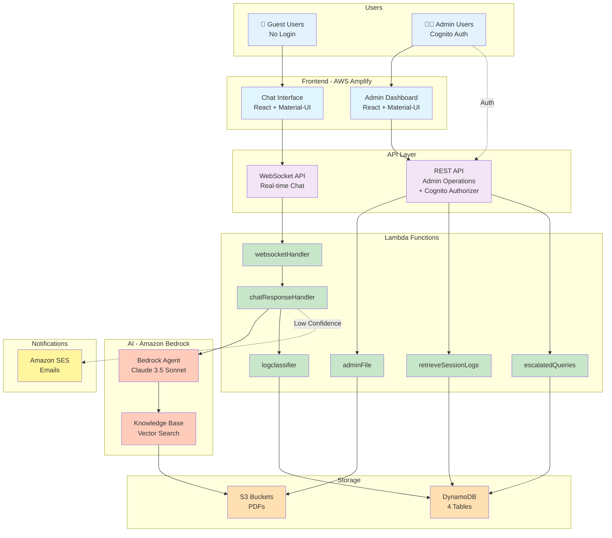
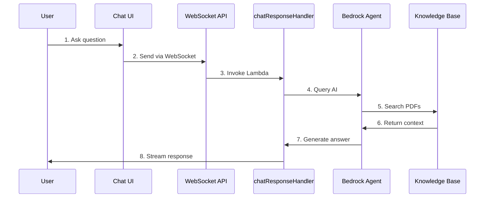
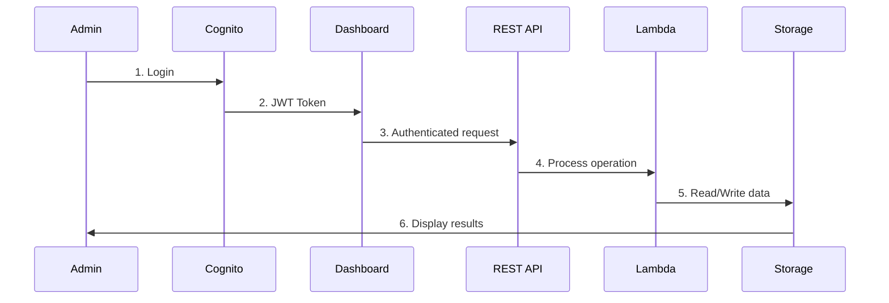
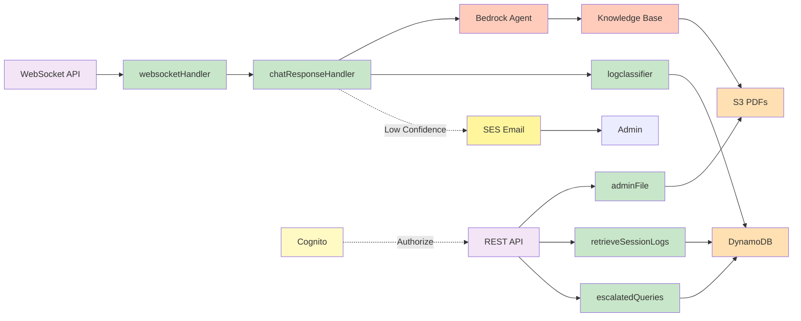

# Learning Navigator - Technical Overview

Crisp technical reference for the MHFA Learning Navigator AI chatbot application.

---

## High-Level Architecture



---

## User Perspective Flow

### Chat Flow (8 Steps)



**Key Points:**
- ✅ No login required (guest mode)
- ✅ Real-time WebSocket streaming
- ✅ AI searches PDF knowledge base
- ✅ Responses include source citations

### Low Confidence Flow (5 Steps)

```
User asks complex question
  ↓ (confidence < 90%)
Request user email
  ↓
Send notification to admin via SES
  ↓
Store in DynamoDB (NCMWEscalatedQueries)
  ↓
Admin emails user directly
```

---

## Admin Perspective Flow

### Admin Workflow (5 Steps)



**Admin Capabilities:**
- 📄 **Document Management** - Upload/delete PDFs → S3 → Auto-sync Knowledge Base
- 📊 **Analytics** - View user stats, sentiment, conversation logs
- ❓ **Escalated Queries** - Manage questions needing expert help
- 📝 **Conversation Logs** - Review chat history with filters

---

## Core Services

### 1. AWS Lambda Functions

| Function | Purpose | Trigger |
|----------|---------|---------|
| **websocketHandler** | Route WebSocket messages | WebSocket API |
| **chatResponseHandler** | Core chat orchestration, invoke Bedrock | websocketHandler |
| **adminFile** | Document upload/delete/list | REST API |
| **retrieveSessionLogs** | Fetch analytics data | REST API |
| **escalatedQueries** | Manage low-confidence queries | REST API |
| **logclassifier** | AI sentiment analysis (background) | chatResponseHandler |

### 2. Amazon Bedrock

| Component | Model/Type | Purpose |
|-----------|-----------|---------|
| **Bedrock Agent** | Claude 3.5 Sonnet V2 | Generate intelligent responses |
| **Knowledge Base** | Titan Embeddings V2 | Vector search in PDFs (RAG) |

**How it Works:**
- Agent receives user query + role context (Instructor/Staff/Learner)
- Knowledge Base searches 1024-dim vectors in PDF documents
- Returns top 5 relevant chunks with confidence score
- Agent generates response with citations

### 3. DynamoDB Tables

| Table | Keys | Purpose |
|-------|------|---------|
| **NCMWDashboardSessionlogs** | session_id, original_ts | Conversation history |
| **NCMWResponseFeedback** | message_id | User thumbs up/down |
| **NCMWEscalatedQueries** | query_id, timestamp | Low confidence tracking |
| **NCMWUserProfiles** | user_id | User roles & preferences |

### 4. S3 Buckets

| Bucket | Contents | Access |
|--------|----------|--------|
| **national-council-s3-pdfs** | Training PDF documents | Bedrock (read), Admins (read/write) |

### 5. Amazon SES

**Purpose:** Email notifications for low-confidence queries

**Flow:**
```
Low confidence detected → SES sends email to admin → Admin replies to user
```

### 6. Amazon Cognito

**Purpose:** Admin authentication (JWT tokens)

**Components:**
- User Pool: Admin user management
- User Pool Client: Token generation
- API Gateway Authorizer: Validate JWT on REST endpoints

### 7. API Gateway

| Type | Purpose | Auth |
|------|---------|------|
| **WebSocket API** | Real-time chat | None (guest) |
| **REST API** | Admin operations | Cognito JWT |

---

## Service Connections

### Data Flow Path

```
┌─────────────────────────────────────────────────────────┐
│ User Chat Flow                                          │
├─────────────────────────────────────────────────────────┤
│ User → WebSocket → websocketHandler →                   │
│   chatResponseHandler → Bedrock Agent → Knowledge Base →│
│   S3 PDFs → Response Stream → User                      │
└─────────────────────────────────────────────────────────┘

┌─────────────────────────────────────────────────────────┐
│ Admin Document Upload Flow                              │
├─────────────────────────────────────────────────────────┤
│ Admin → REST API (JWT) → adminFile → S3 Upload →        │
│   Trigger KB Sync → Bedrock Ingestion → Ready           │
└─────────────────────────────────────────────────────────┘

┌─────────────────────────────────────────────────────────┐
│ Analytics Flow                                          │
├─────────────────────────────────────────────────────────┤
│ Admin → REST API (JWT) → retrieveSessionLogs →          │
│   Query DynamoDB (SessionLogs + Feedback) →             │
│   Aggregate Data → Display Dashboard                    │
└─────────────────────────────────────────────────────────┘

┌─────────────────────────────────────────────────────────┐
│ Background Logging Flow                                 │
├─────────────────────────────────────────────────────────┤
│ chatResponseHandler → logclassifier (async) →           │
│   Bedrock Nova Lite (AI sentiment) →                    │
│   Store in DynamoDB SessionLogs                         │
└─────────────────────────────────────────────────────────┘
```

### Service Dependencies



---

## Technology Stack

### Frontend
- **Framework:** React 18
- **UI Library:** Material-UI v5
- **Real-time:** Native WebSocket
- **Hosting:** AWS Amplify

### Backend
- **Compute:** AWS Lambda (Python 3.12)
- **Infrastructure:** AWS CDK (TypeScript)
- **AI:** Amazon Bedrock (Claude 3.5 Sonnet, Titan Embeddings)

### Storage
- **Documents:** Amazon S3
- **Database:** Amazon DynamoDB (on-demand)

### Security
- **Authentication:** Amazon Cognito (JWT)
- **Authorization:** API Gateway Cognito Authorizer
- **Encryption:** S3 SSE, DynamoDB encryption at rest

---

## Key Features

### 1. Guest Chat (No Login)
Users interact without authentication. Session ID generated client-side.

### 2. Role-Based Responses
AI tailors responses based on user role:
- 🎓 **Instructor** - Teaching resources
- 💼 **Staff** - Administrative guidance
- 👤 **Learner** - Course information

### 3. Confidence-Based Routing
- **≥90%:** Direct AI response with citations
- **<90%:** Escalate to admin via email

### 4. Real-Time Streaming
WebSocket connection streams response tokens as generated (ChatGPT-like UX).

### 5. User Feedback
Thumbs up/down on each response → Stored in DynamoDB → Displayed in admin analytics.

### 6. Auto-Sync Knowledge Base
Upload PDF → S3 event triggers Bedrock ingestion → Available in 2-5 minutes.

---

## Performance Metrics

| Operation | Average Time |
|-----------|-------------|
| WebSocket Connect | 100ms |
| Send Message | 50ms |
| Bedrock Response | 10-15s (streaming) |
| First Token | 2-3s |
| Document Upload | 2-3s |
| KB Ingestion | 2-5 min (async) |

---

## Cost Estimate

**10,000 conversations/month:**
- Bedrock: $15-20
- Lambda: $2-5
- DynamoDB: $1-2
- API Gateway: $0.50-1
- S3: $2-3
- **Total: ~$25-35/month**

---

## Security

✅ TLS 1.2+ for all connections
✅ DynamoDB & S3 encryption at rest
✅ Cognito JWT validation on admin endpoints
✅ IAM least-privilege roles
✅ No PII stored without consent

---

## Quick Reference

### Environment Variables

**Frontend:**
- `REACT_APP_WEBSOCKET_API` - WebSocket endpoint
- `REACT_APP_ANALYTICS_API` - REST API endpoint
- `REACT_APP_COGNITO_USER_POOL_ID` - Auth pool
- `REACT_APP_COGNITO_CLIENT_ID` - Auth client

**Backend:**
- `WS_API_ENDPOINT` - WebSocket callback URL
- `AGENT_ID` - Bedrock Agent ID
- `AGENT_ALIAS_ID` - Bedrock Agent Alias
- `KNOWLEDGE_BASE_ID` - KB ID
- `BUCKET_NAME` - S3 bucket name
- `DYNAMODB_TABLE` - Table names
- `ADMIN_EMAIL` - Admin notification email

### API Endpoints

```
WebSocket API:
wss://{api-id}.execute-api.{region}.amazonaws.com/prod

REST API:
https://{api-id}.execute-api.{region}.amazonaws.com/prod
  GET  /session-logs
  GET  /files
  POST /files
  DELETE /files/{key}
  GET  /escalated-queries
  PUT  /escalated-queries
```

---

## Deployment

```bash
# Prerequisites
npm install -g aws-cdk
aws configure

# Deploy
cd cdk_backend
npm install
cdk bootstrap --all -c githubOwner=YOUR_USERNAME -c githubRepo=REPO_NAME -c adminEmail=ADMIN_EMAIL
cdk deploy --all -c githubOwner=YOUR_USERNAME -c githubRepo=REPO_NAME -c adminEmail=ADMIN_EMAIL
```

---

## Troubleshooting

| Issue | Solution |
|-------|----------|
| WebSocket fails | Check API Gateway URL, verify Lambda permissions |
| No AI response | Verify Bedrock Agent status is "Prepared" |
| KB sync fails | Check PDF validity, verify S3 bucket name |
| Admin can't login | Verify user exists in Cognito User Pool |

---

## Related Documentation

- **[Simple Architecture](SIMPLE_ARCHITECTURE.md)** - Stakeholder-friendly overview
- **[User AWS Architecture](USER_AWS_ARCHITECTURE.md)** - Detailed user flows (7 diagrams)
- **[Admin AWS Architecture](ADMIN_AWS_ARCHITECTURE.md)** - Detailed admin flows (6 diagrams)
- **[User Flow Steps](USER_FLOW_STEPS.md)** - 32-step user breakdown
- **[Admin Flow Steps](ADMIN_FLOW_STEPS.md)** - 39-step admin breakdown
- **[Full Technical Docs](architecture/TECHNICAL_DOCUMENTATION.md)** - Complete reference (2100+ lines)

---

**Version:** 1.0
**Last Updated:** January 11, 2026
**Status:** Production Ready
