# User Chat Flow - AWS Architecture & Diagrams

This document provides comprehensive AWS architecture diagrams, sequence diagrams, and detailed flow breakdowns specifically for the **User Chat Experience** of the Learning Navigator application.

---

## Table of Contents

1. [User AWS Architecture Overview](#user-aws-architecture-overview)
2. [Guest User Chat Flow (High Confidence)](#guest-user-chat-flow-high-confidence)
3. [Low Confidence Escalation Flow](#low-confidence-escalation-flow)
4. [User Feedback Flow](#user-feedback-flow)
5. [Background Logging & Classification Flow](#background-logging--classification-flow)
6. [User Profile & Recommendations Flow](#user-profile--recommendations-flow)
7. [Complete User Service Map](#complete-user-service-map)

---

## User AWS Architecture Overview

### High-Level User Architecture


---

## Guest User Chat Flow (High Confidence)

### Sequence Diagram - Successful Chat Interaction

```mermaid
sequenceDiagram
    participant User as Guest User<br/>(No Login)
    participant UI as Chat UI<br/>ChatBubbleComponent
    participant WS as WebSocket API<br/>Gateway
    participant WSHandler as websocketHandler<br/>Lambda
    participant ChatHandler as chatResponseHandler<br/>Lambda
    participant Agent as Bedrock Agent<br/>Claude 3.5 Sonnet
    participant KB as Knowledge Base<br/>Vector Search
    participant S3 as S3 Bucket<br/>PDFs
    participant Logger as logclassifier<br/>Lambda (async)
    participant DDB as DynamoDB<br/>SessionLogs

    User->>UI: 1. Type: "How do I become an MHFA instructor?"
    UI->>UI: 2. Generate session_id (guest_xxx)
    UI->>WS: 3. WebSocket $connect
    WS->>WSHandler: 4. Invoke with $connect route
    WSHandler->>WSHandler: 5. Store connectionId
    WSHandler->>WS: 6. Return 200
    WS->>UI: 7. Connection established

    UI->>WS: 8. Send message via WebSocket<br/>{action: "sendMessage", query, session_id}
    WS->>WSHandler: 9. Route to sendMessage handler
    WSHandler->>WSHandler: 10. Validate payload

    WSHandler->>ChatHandler: 11. Async invoke with payload
    Note over WSHandler: Returns immediately to avoid WS timeout

    ChatHandler->>ChatHandler: 12. Extract query, session_id, role
    ChatHandler->>Agent: 13. InvokeAgent with streaming<br/>sessionId, inputText, role context

    Agent->>Agent: 14. Parse query intent
    Agent->>KB: 15. Retrieve relevant chunks<br/>Vector similarity search
    KB->>S3: 16. Fetch source documents
    S3->>KB: 17. Return PDF content
    KB->>Agent: 18. Return top 5 chunks with citations

    Agent->>Agent: 19. Generate response with Claude 3.5 Sonnet<br/>Stream tokens back

    loop Streaming Response
        Agent->>ChatHandler: 20. Stream chunk {"chunk": {"bytes": "..."}}
        ChatHandler->>ChatHandler: 21. Decode base64 chunk
        ChatHandler->>ChatHandler: 22. Parse JSON events (text, citations)
        ChatHandler->>WS: 23. Post to connection<br/>@connections/{connectionId}
        WS->>UI: 24. Push message to client
        UI->>User: 25. Display streaming text
    end

    Agent->>ChatHandler: 26. Complete with metadata<br/>{confidence_score: 95.5, citations: [...]}
    ChatHandler->>ChatHandler: 27. Evaluate confidence (95.5% > 90%)

    Note over ChatHandler: High confidence - no escalation needed

    ChatHandler->>WS: 28. Post final message with citations
    WS->>UI: 29. Stream complete
    UI->>User: 30. Display full response + citations

    ChatHandler->>Logger: 31. Async invoke (background)<br/>Pass session data
    Logger->>Logger: 32. AI sentiment analysis (Nova Lite)
    Logger->>DDB: 33. Store conversation log<br/>{query, response, confidence, category}
    DDB->>Logger: 34. Success

    UI->>User: 35. Show feedback buttons (👍 👎)
```



### Step-by-Step Flow

#### **Step 1-2: User Initiates Chat**
- **Component**: [ChatBubbleComponent.jsx](../frontend/src/Components/ChatBubbleComponent.jsx)
- **User Action**: Types question in chat input
- **Session ID Generation**:
```javascript
// Generate unique guest session ID
const sessionId = `guest_${Date.now()}_${Math.random().toString(36).substr(2, 9)}`;
// Example: guest_1704995530_k3j9d2x8a
```

#### **Step 3-7: WebSocket Connection Establishment**
- **Service**: AWS API Gateway WebSocket API
- **Endpoint**: `wss://your-websocket-api.execute-api.us-east-1.amazonaws.com/prod`

**Frontend Code**:
```javascript
const ws = new WebSocket(WEBSOCKET_URL);

ws.onopen = () => {
  console.log('WebSocket connected');
  setIsConnected(true);
};

ws.onmessage = (event) => {
  const data = JSON.parse(event.data);
  handleIncomingMessage(data);
};

ws.onerror = (error) => {
  console.error('WebSocket error:', error);
};
```

**WebSocket $connect Event**:
```json
{
  "requestContext": {
    "routeKey": "$connect",
    "connectionId": "abc123xyz789",
    "eventType": "CONNECT",
    "requestTime": "11/Jan/2026:14:30:00 +0000",
    "requestTimeEpoch": 1704995400000,
    "domainName": "your-websocket-api.execute-api.us-east-1.amazonaws.com",
    "stage": "prod"
  },
  "isBase64Encoded": false
}
```

**websocketHandler Lambda** ([handler.py](../cdk_backend/lambda/websocketHandler/handler.py)):
```python
def lambda_handler(event, context):
    route_key = event["requestContext"]["routeKey"]
    connection_id = event["requestContext"]["connectionId"]

    if route_key == "$connect":
        log(f"New connection: {connection_id}")
        # Connection automatically managed by API Gateway
        return {"statusCode": 200}
```

#### **Step 8-10: Send Message via WebSocket**
**Frontend Code**:
```javascript
const sendMessage = (query) => {
  const payload = {
    action: "sendMessage",
    query: query,
    session_id: sessionId,
    role: userRole || "guest",  // learner, instructor, staff, or guest
    timestamp: new Date().toISOString()
  };

  ws.send(JSON.stringify(payload));
};
```

**WebSocket Message Event**:
```json
{
  "requestContext": {
    "routeKey": "sendMessage",
    "connectionId": "abc123xyz789",
    "eventType": "MESSAGE"
  },
  "body": "{\"action\":\"sendMessage\",\"query\":\"How do I become an MHFA instructor?\",\"session_id\":\"guest_1704995530_k3j9d2x8a\",\"role\":\"guest\"}"
}
```

#### **Step 11: Async Lambda Invocation**
**websocketHandler Lambda**:
```python
def handle_send_message(event, body):
    # Parse message
    query = body.get("query")
    session_id = body.get("session_id")
    role = body.get("role", "guest")

    # Invoke chatResponseHandler asynchronously to avoid WebSocket timeout (30s limit)
    lambda_client.invoke(
        FunctionName=os.environ["RESPONSE_FUNCTION_ARN"],
        InvocationType="Event",  # Async invocation
        Payload=json.dumps({
            "query": query,
            "session_id": session_id,
            "connection_id": event["requestContext"]["connectionId"],
            "role": role,
            "websocket_endpoint": os.environ["WS_API_ENDPOINT"]
        })
    )

    # Return immediately to keep WebSocket alive
    return {"statusCode": 200}
```

**Why Async Invocation?**
- WebSocket connections have a **30-second timeout**
- Bedrock Agent responses can take **10-20 seconds**
- Async invocation prevents timeout and allows streaming

#### **Step 12-13: chatResponseHandler Invokes Bedrock Agent**
**Lambda**: [chatResponseHandler](../cdk_backend/lambda/chatResponseHandler/handler.py)

```python
def lambda_handler(event, context):
    query = event["query"]
    session_id = event["session_id"]
    connection_id = event["connection_id"]
    role = event.get("role", "guest")
    ws_endpoint = event["websocket_endpoint"]

    log(f"Processing query for session {session_id}")

    # Build role-specific context
    role_context = get_role_context(role)  # Personalized instructions

    # Invoke Bedrock Agent with streaming
    response = bedrock_agent_runtime.invoke_agent(
        agentId=os.environ["AGENT_ID"],
        agentAliasId=os.environ["AGENT_ALIAS_ID"],
        sessionId=session_id,
        inputText=f"{role_context}\n\nUser Query: {query}",
        enableTrace=True,  # Get confidence scores
        sessionState={
            "sessionAttributes": {
                "user_role": role,
                "timestamp": datetime.utcnow().isoformat()
            }
        }
    )

    return process_streaming_response(response, connection_id, ws_endpoint)
```

**Role Context Examples**:
```python
def get_role_context(role):
    contexts = {
        "instructor": "You are assisting an MHFA Instructor. Focus on teaching resources, course management, and instructor certification.",
        "learner": "You are assisting a learner taking MHFA courses. Focus on course registration, certification requirements, and learning materials.",
        "staff": "You are assisting internal staff. Focus on administrative processes, system operations, and organizational policies.",
        "guest": "You are assisting a general visitor. Provide comprehensive information about MHFA programs."
    }
    return contexts.get(role, contexts["guest"])
```

#### **Step 14-18: Bedrock Agent Knowledge Base Retrieval**
**Bedrock Agent Configuration**:
- **Model**: Claude 3.5 Sonnet V2 (`anthropic.claude-3-5-sonnet-20241022-v2:0`)
- **Knowledge Base**: OpenSearch Serverless with Titan Embeddings V2
- **Retrieval Strategy**: Semantic similarity search with reranking

**Vector Search Process**:
1. **Query Embedding**: Generate vector for user query using Titan Embeddings
   ```
   Query: "How do I become an MHFA instructor?"
   → Embedding: [0.234, -0.456, 0.789, ..., 0.123] (1024 dimensions)
   ```

2. **Similarity Search**: Find top K most similar document chunks
   ```python
   # OpenSearch query (internal to Bedrock)
   {
     "size": 5,
     "query": {
       "knn": {
         "embedding_field": {
           "vector": [0.234, -0.456, ...],
           "k": 5
         }
       }
     }
   }
   ```

3. **Reranking**: Score results using semantic relevance (0-100)

**Retrieved Chunks Example**:
```json
[
  {
    "content": "To become a Mental Health First Aid instructor, candidates must complete the MHFA Instructor Training Course. Prerequisites include being at least 18 years old, completing the standard 8-hour MHFA certification, and having strong facilitation skills.",
    "source": "s3://national-council-s3-pdfs/mhfa_instructor_guide.pdf",
    "page": 12,
    "score": 92.5,
    "metadata": {
      "title": "MHFA Instructor Guide",
      "last_updated": "2025-11-15"
    }
  },
  {
    "content": "The Instructor Training Course spans 4 consecutive days and includes pre-work assignments totaling approximately 8 hours. Participants must pass a final assessment with 80% or higher.",
    "source": "s3://national-council-s3-pdfs/instructor_training_requirements.pdf",
    "page": 5,
    "score": 88.3
  }
]
```

#### **Step 19-25: Streaming Response Generation**
**Bedrock Agent Response Stream**:
```python
def process_streaming_response(response, connection_id, ws_endpoint):
    full_response = ""
    citations = []
    confidence_score = 0

    # Process stream events
    for event in response["completion"]:
        if "chunk" in event:
            # Decode chunk
            chunk_data = json.loads(
                base64.b64decode(event["chunk"]["bytes"]).decode("utf-8")
            )

            # Handle different event types
            if chunk_data.get("type") == "chunk":
                # Text chunk
                text = chunk_data.get("text", "")
                full_response += text

                # Send to WebSocket
                send_to_websocket(ws_endpoint, connection_id, {
                    "type": "text_chunk",
                    "content": text
                })

            elif chunk_data.get("type") == "metadata":
                # Citations and confidence
                citations = chunk_data.get("citations", [])
                confidence_score = chunk_data.get("confidence", 0)

    return full_response, citations, confidence_score
```

**WebSocket Message Format** (sent to client):
```json
{
  "type": "text_chunk",
  "content": "To become a Mental Health First Aid instructor"
}
```

**Frontend Handling**:
```javascript
ws.onmessage = (event) => {
  const data = JSON.parse(event.data);

  if (data.type === "text_chunk") {
    // Append to existing message (streaming effect)
    setMessages(prev => {
      const lastMsg = prev[prev.length - 1];
      if (lastMsg && lastMsg.role === "assistant" && lastMsg.streaming) {
        return [
          ...prev.slice(0, -1),
          { ...lastMsg, content: lastMsg.content + data.content }
        ];
      }
    });
  }
};
```

#### **Step 26-27: Confidence Evaluation**
**chatResponseHandler Lambda**:
```python
# Extract confidence from Bedrock Agent metadata
confidence_score = extract_confidence(response)  # 95.5%

log(f"Confidence score: {confidence_score}%")

if confidence_score >= 90:
    log("HIGH CONFIDENCE - Sending response directly")
    send_final_message(ws_endpoint, connection_id, {
        "type": "complete",
        "confidence": confidence_score,
        "citations": citations
    })
else:
    log("LOW CONFIDENCE - Triggering escalation")
    trigger_escalation(query, session_id, user_email, confidence_score)
```

**Confidence Score Calculation** (internal to Bedrock Agent):
- **Citation Match**: 40% weight - Are there relevant source documents?
- **Semantic Similarity**: 30% weight - How closely do chunks match the query?
- **Response Completeness**: 20% weight - Does response answer all parts of query?
- **Reranking Score**: 10% weight - Cross-encoder validation

**Example Scores**:
- Query: "How to become instructor?" → **95.5%** (clear match with instructor guide)
- Query: "What is the incident reporting process?" → **35.0%** (no matching documents)

#### **Step 28-30: Final Message with Citations**
```json
{
  "type": "complete",
  "confidence": 95.5,
  "citations": [
    {
      "source": "mhfa_instructor_guide.pdf",
      "page": 12,
      "text": "To become a Mental Health First Aid instructor, candidates must complete...",
      "url": "/files/mhfa_instructor_guide.pdf#page=12"
    },
    {
      "source": "instructor_training_requirements.pdf",
      "page": 5,
      "text": "The Instructor Training Course spans 4 consecutive days...",
      "url": "/files/instructor_training_requirements.pdf#page=5"
    }
  ]
}
```

**Frontend Citation Display**:
```jsx
{message.citations && (
  <Box sx={{ mt: 2, p: 2, bgcolor: '#f5f5f5', borderRadius: 2 }}>
    <Typography variant="subtitle2" fontWeight={600}>
      📚 Sources:
    </Typography>
    {message.citations.map((citation, idx) => (
      <Box key={idx} sx={{ mt: 1 }}>
        <Link href={citation.url} target="_blank">
          {citation.source} (page {citation.page})
        </Link>
      </Box>
    ))}
  </Box>
)}
```

#### **Step 31-34: Background Logging (Async)**
**chatResponseHandler Lambda**:
```python
# Invoke logclassifier Lambda asynchronously (no need to wait)
lambda_client.invoke(
    FunctionName=os.environ["LOG_CLASSIFIER_FN_NAME"],
    InvocationType="Event",  # Fire and forget
    Payload=json.dumps({
        "session_id": session_id,
        "query": query,
        "response": full_response,
        "confidence_score": confidence_score,
        "citations": citations,
        "timestamp": datetime.utcnow().isoformat()
    })
)
```

**logclassifier Lambda** ([handler.py](../cdk_backend/lambda/logclassifier/handler.py)):
```python
def lambda_handler(event, context):
    # AI-based sentiment analysis using Nova Lite
    sentiment_result = bedrock_runtime.invoke_model(
        modelId="amazon.nova-lite-v1:0",
        body=json.dumps({
            "messages": [{
                "role": "user",
                "content": f"Analyze this conversation and rate satisfaction (0-100):\n\nQuery: {event['query']}\n\nResponse: {event['response']}"
            }],
            "inferenceConfig": {
                "temperature": 0.3,
                "max_new_tokens": 200
            }
        })
    )

    # Parse AI response
    satisfaction_score = extract_score(sentiment_result)
    category = classify_category(event["query"])

    # Store in DynamoDB
    table.put_item(Item={
        "session_id": event["session_id"],
        "original_ts": event["timestamp"],
        "query": event["query"],
        "response": event["response"],
        "confidence_score": event["confidence_score"],
        "satisfaction_score": satisfaction_score,
        "category": category,
        "sentiment": "neutral",  # Will be overridden by user feedback
        "citations": event["citations"]
    })
```

**DynamoDB Item**:
```json
{
  "session_id": "guest_1704995530_k3j9d2x8a",
  "original_ts": "2026-01-11T14:32:10Z",
  "query": "How do I become an MHFA instructor?",
  "response": "To become a Mental Health First Aid instructor...",
  "confidence_score": 95.5,
  "satisfaction_score": 85.0,
  "category": "Training Information",
  "sentiment": "neutral",
  "citations": [...]
}
```

---

## Low Confidence Escalation Flow

### Sequence Diagram - Email Escalation


### Step-by-Step Flow

#### **Step 1-6: Low Confidence Detection**
**Query Example**: "What is the incident reporting process for training incidents?"

**Bedrock Agent Response**:
```json
{
  "completion": "I don't have specific information about incident reporting processes in my current knowledge base. This appears to be an administrative policy question that would require access to internal documentation.",
  "confidence_score": 35.0,
  "citations": [],
  "reason": "No relevant documents found in knowledge base search"
}
```

#### **Step 7-8: Confidence Threshold Check**
```python
CONFIDENCE_THRESHOLD = 90.0

if confidence_score < CONFIDENCE_THRESHOLD:
    log(f"LOW CONFIDENCE: {confidence_score}% < {CONFIDENCE_THRESHOLD}%")

    # Still send the response to user (transparent about limitations)
    send_to_websocket(ws_endpoint, connection_id, {
        "type": "complete",
        "content": agent_response,
        "confidence": confidence_score,
        "low_confidence": True  # Flag for UI
    })

    # Trigger escalation flow
    request_user_email(connection_id)
```

#### **Step 9-10: Email Request Modal**
**WebSocket Message**:
```json
{
  "type": "request_email",
  "message": "This question requires expert attention. Please provide your email so we can follow up with a detailed answer.",
  "query": "What is the incident reporting process?"
}
```

**Frontend Modal**:
```jsx
{showEmailModal && (
  <Modal open={true} onClose={() => setShowEmailModal(false)}>
    <Box sx={{ p: 4, bgcolor: 'white', borderRadius: 2 }}>
      <Typography variant="h6" mb={2}>
        We'll have an expert reach out
      </Typography>
      <Typography mb={3}>
        Your question requires specialized knowledge. Please provide your email
        so our team can follow up with a comprehensive answer.
      </Typography>
      <TextField
        fullWidth
        label="Email Address"
        value={email}
        onChange={(e) => setEmail(e.target.value)}
        placeholder="your.email@example.com"
      />
      <Button
        variant="contained"
        onClick={handleSubmitEmail}
        sx={{ mt: 2 }}
      >
        Submit
      </Button>
    </Box>
  </Modal>
)}
```

#### **Step 11-13: User Submits Email**
```javascript
const handleSubmitEmail = () => {
  ws.send(JSON.stringify({
    action: "submitEmail",
    email: email,
    session_id: sessionId,
    query: currentQuery
  }));
  setShowEmailModal(false);
};
```

#### **Step 14-16: Email Lambda Stores Escalation**
**email Lambda** ([handler.py](../cdk_backend/lambda/email/handler.py)):
```python
def lambda_handler(event, context):
    query = event["query"]
    user_email = event["user_email"]
    session_id = event["session_id"]
    confidence = event["confidence_score"]

    # Generate unique query ID
    query_id = f"escalated_{session_id}_{int(time.time())}"

    # Store in DynamoDB
    escalated_table.put_item(Item={
        "query_id": query_id,
        "timestamp": datetime.utcnow().isoformat() + "Z",
        "session_id": session_id,
        "status": "pending",
        "query": query,
        "user_email": user_email,
        "confidence_score": confidence,
        "agent_response": event.get("agent_response", ""),
        "admin_notes": "",
        "created_at": datetime.utcnow().isoformat() + "Z",
        "updated_at": datetime.utcnow().isoformat() + "Z"
    })

    # Send email to admin
    send_admin_notification(query, user_email, query_id)

    return {"statusCode": 200, "message": "Escalation successful"}
```

#### **Step 17-18: SES Email Notification**
**Email Template**:
```python
def send_admin_notification(query, user_email, query_id):
    email_body = f"""
    <html>
    <body>
        <h2>Low Confidence Query Escalation</h2>
        <p><strong>Query ID:</strong> {query_id}</p>
        <p><strong>User Email:</strong> {user_email}</p>
        <p><strong>Timestamp:</strong> {datetime.utcnow().strftime('%Y-%m-%d %H:%M:%S UTC')}</p>

        <h3>User Question:</h3>
        <p>{query}</p>

        <h3>Action Required:</h3>
        <p>Please review this query and respond directly to the user at {user_email}.</p>
        <p>You can also update the status in the admin portal at:</p>
        <p><a href="https://your-app.amplifyapp.com/admin-queries">Admin Portal</a></p>
    </body>
    </html>
    """

    ses.send_email(
        Source=os.environ["ADMIN_EMAIL"],
        Destination={"ToAddresses": [os.environ["ADMIN_EMAIL"]]},
        Message={
            "Subject": {"Data": f"Low Confidence Query - {query_id}"},
            "Body": {"Html": {"Data": email_body}}
        }
    )
```

**Email Preview**:
```
Subject: Low Confidence Query - escalated_guest_1704995530_1704995650

Low Confidence Query Escalation

Query ID: escalated_guest_1704995530_1704995650
User Email: instructor@example.com
Timestamp: 2026-01-11 14:34:10 UTC

User Question:
What is the incident reporting process for training incidents?

Action Required:
Please review this query and respond directly to the user at instructor@example.com.
You can also update the status in the admin portal.
```

#### **Step 19-21: Confirmation to User**
```json
{
  "type": "escalation_complete",
  "message": "Thank you! An expert from our team will reach out to you at instructor@example.com within 24-48 hours with a detailed answer.",
  "query_id": "escalated_guest_1704995530_1704995650"
}
```

---

## User Feedback Flow

### Sequence Diagram - Thumbs Up/Down

```mermaid
sequenceDiagram
    participant User as Guest User
    participant UI as Chat UI
    participant APIGW as API Gateway<br/>REST API
    participant FeedbackLambda as responseFeedback<br/>Lambda
    participant DDB as DynamoDB<br/>ResponseFeedback

    User->>UI: 1. View bot response
    UI->>User: 2. Display feedback buttons (👍 👎)
    User->>UI: 3. Click 👍 (Thumbs Up)

    UI->>APIGW: 4. POST /feedback<br/>{message_id, feedback: "positive"}
    APIGW->>FeedbackLambda: 5. Invoke Lambda

    FeedbackLambda->>FeedbackLambda: 6. Validate payload
    FeedbackLambda->>DDB: 7. Put item<br/>{message_id, feedback, timestamp}
    DDB->>FeedbackLambda: 8. Success

    FeedbackLambda->>APIGW: 9. Return 200 {message: "Feedback recorded"}
    APIGW->>UI: 10. Return success
    UI->>User: 11. Update button state (filled icon)
```



### Step-by-Step Flow

#### **Step 1-3: User Clicks Feedback Button**
**Frontend Component**:
```jsx
const MessageBubble = ({ message }) => {
  const [userFeedback, setUserFeedback] = useState(null);

  const handleFeedback = async (feedbackType) => {
    setUserFeedback(feedbackType);

    try {
      await axios.post(`${DOCUMENTS_API}feedback`, {
        message_id: message.id,
        session_id: sessionId,
        feedback: feedbackType,  // "positive" or "negative"
        timestamp: new Date().toISOString()
      });
    } catch (error) {
      console.error('Failed to submit feedback:', error);
    }
  };

  return (
    <Box>
      <Typography>{message.content}</Typography>
      <Box sx={{ display: 'flex', gap: 1, mt: 1 }}>
        <IconButton
          onClick={() => handleFeedback('positive')}
          color={userFeedback === 'positive' ? 'success' : 'default'}
        >
          <ThumbUpIcon />
        </IconButton>
        <IconButton
          onClick={() => handleFeedback('negative')}
          color={userFeedback === 'negative' ? 'error' : 'default'}
        >
          <ThumbDownIcon />
        </IconButton>
      </Box>
    </Box>
  );
};
```

#### **Step 4-5: API Request**
**HTTP Request**:
```http
POST /feedback HTTP/1.1
Host: api.example.com
Content-Type: application/json

{
  "message_id": "guest_1704995530_k3j9d2x8a_1704995530",
  "session_id": "guest_1704995530_k3j9d2x8a",
  "feedback": "positive",
  "timestamp": "2026-01-11T14:32:45Z"
}
```

#### **Step 6-8: Store Feedback in DynamoDB**
**responseFeedback Lambda** ([handler.py](../cdk_backend/lambda/responseFeedback/handler.py)):
```python
def lambda_handler(event, context):
    body = json.loads(event["body"])

    message_id = body["message_id"]
    feedback = body["feedback"]  # "positive" or "negative"
    session_id = body["session_id"]
    timestamp = body["timestamp"]

    # Validate feedback value
    if feedback not in ["positive", "negative"]:
        return {
            "statusCode": 400,
            "body": json.dumps({"error": "Invalid feedback value"})
        }

    # Store in DynamoDB
    table.put_item(Item={
        "message_id": message_id,
        "session_id": session_id,
        "feedback": feedback,
        "timestamp": timestamp,
        "created_at": datetime.utcnow().isoformat() + "Z"
    })

    log(f"Feedback recorded: {message_id} = {feedback}")

    return {
        "statusCode": 200,
        "headers": {
            "Content-Type": "application/json",
            "Access-Control-Allow-Origin": "*"
        },
        "body": json.dumps({"message": "Feedback recorded successfully"})
    }
```

**DynamoDB Item**:
```json
{
  "message_id": "guest_1704995530_k3j9d2x8a_1704995530",
  "session_id": "guest_1704995530_k3j9d2x8a",
  "feedback": "positive",
  "timestamp": "2026-01-11T14:32:45Z",
  "created_at": "2026-01-11T14:32:45Z"
}
```

#### **How Feedback is Used**:
1. **Admin Analytics**: Displayed in dashboard as positive/negative/neutral counts
2. **Sentiment Override**: User feedback (👍👎) overrides AI sentiment analysis
3. **Quality Metrics**: Track user satisfaction over time
4. **Conversation Filtering**: Filter logs by sentiment in admin portal

---

## Background Logging & Classification Flow

### Sequence Diagram


### Step-by-Step Flow

#### **Step 1: Async Invocation from chatResponseHandler**
```python
# After completing chat response
lambda_client.invoke(
    FunctionName=os.environ["LOG_CLASSIFIER_FN_NAME"],
    InvocationType="Event",  # Fire and forget - don't wait for response
    Payload=json.dumps({
        "session_id": session_id,
        "query": query,
        "response": full_response,
        "confidence_score": confidence_score,
        "citations": citations,
        "role": user_role,
        "timestamp": datetime.utcnow().isoformat()
    })
)
```

#### **Step 2-5: AI Sentiment Analysis**
**logclassifier Lambda** ([handler.py](../cdk_backend/lambda/logclassifier/handler.py)):
```python
def lambda_handler(event, context):
    query = event["query"]
    response = event["response"]

    # Invoke Nova Lite for sentiment analysis
    prompt = f"""
    Analyze this chatbot conversation and provide:
    1. Satisfaction score (0-100) based on:
       - Relevance: Does the response address the query? (30%)
       - Completeness: Is the answer thorough? (30%)
       - Clarity: Is it easy to understand? (20%)
       - Actionability: Can the user act on it? (20%)

    2. Category classification (one of):
       - Training Information
       - Certification Requirements
       - Instructor Resources
       - Course Registration
       - Technical Support
       - General Inquiry

    User Query: {query}

    Bot Response: {response}

    Respond in JSON format:
    {{"satisfaction_score": 85, "category": "Training Information", "reasoning": "..."}}
    """

    bedrock_response = bedrock_runtime.invoke_model(
        modelId="amazon.nova-lite-v1:0",
        body=json.dumps({
            "messages": [{"role": "user", "content": prompt}],
            "inferenceConfig": {
                "temperature": 0.3,
                "max_new_tokens": 300
            }
        })
    )

    # Parse AI response
    result = json.loads(bedrock_response["body"].read())
    ai_output = json.loads(result["output"]["message"]["content"][0]["text"])

    satisfaction_score = ai_output["satisfaction_score"]
    category = ai_output["category"]

    # Store in DynamoDB
    store_conversation_log(event, satisfaction_score, category)

    return {"statusCode": 200}
```

**AI Response Example**:
```json
{
  "satisfaction_score": 85,
  "category": "Training Information",
  "reasoning": "The response directly addresses the query about becoming an instructor, provides comprehensive prerequisites, timeline, and actionable next steps. High relevance and completeness."
}
```

#### **Step 6-7: Store in DynamoDB**
```python
def store_conversation_log(event, satisfaction_score, category):
    table.put_item(Item={
        "session_id": event["session_id"],
        "original_ts": event["timestamp"],
        "query": event["query"],
        "response": event["response"],
        "confidence_score": event["confidence_score"],
        "satisfaction_score": satisfaction_score,
        "category": category,
        "sentiment": "neutral",  # Default - overridden by user feedback
        "role": event.get("role", "guest"),
        "citations": event.get("citations", []),
        "location": "US-East"  # Could be extracted from IP
    })
```

---

## User Profile & Recommendations Flow

### Sequence Diagram


### Step-by-Step Flow

#### **Step 1-3: Role Selection**
**Frontend Component**:
```jsx
const ProfileModal = () => {
  const roles = [
    {
      id: 'instructor',
      title: 'MHFA Instructor',
      icon: '🎓',
      description: 'Certified instructors delivering training'
    },
    {
      id: 'staff',
      title: 'Internal Staff',
      icon: '💼',
      description: 'Administrative and support staff'
    },
    {
      id: 'learner',
      title: 'Learner',
      icon: '👤',
      description: 'Individuals taking MHFA courses'
    }
  ];

  const handleRoleSelect = async (roleId) => {
    // Store locally
    localStorage.setItem('userRole', roleId);
    setUserRole(roleId);

    // Send to backend
    await axios.post(`${DOCUMENTS_API}profile`, {
      user_id: sessionId,  // Use session ID as user ID for guests
      role: roleId
    });

    // Fetch recommendations
    fetchRecommendations(roleId);
  };

  return (
    <Modal>
      {roles.map(role => (
        <Card key={role.id} onClick={() => handleRoleSelect(role.id)}>
          <Typography variant="h4">{role.icon}</Typography>
          <Typography variant="h6">{role.title}</Typography>
          <Typography>{role.description}</Typography>
        </Card>
      ))}
    </Modal>
  );
};
```

#### **Step 4-9: Store Profile and Generate Recommendations**
**userProfile Lambda** ([handler.py](../cdk_backend/lambda/userProfile/handler.py)):
```python
def lambda_handler(event, context):
    body = json.loads(event["body"])
    user_id = body["user_id"]
    role = body["role"]

    # Generate role-specific recommendations
    recommendations = generate_recommendations(role)

    # Store profile
    table.put_item(Item={
        "user_id": user_id,
        "role": role,
        "recommendations": recommendations,
        "created_at": datetime.utcnow().isoformat(),
        "updated_at": datetime.utcnow().isoformat()
    })

    return {
        "statusCode": 200,
        "headers": {"Access-Control-Allow-Origin": "*"},
        "body": json.dumps({
            "user_id": user_id,
            "role": role,
            "recommendations": recommendations
        })
    }

def generate_recommendations(role):
    recommendations_map = {
        "instructor": {
            "quick_actions": [
                {
                    "title": "Course Management",
                    "description": "Manage your MHFA courses and participants",
                    "queries": [
                        "How do I register a new course?",
                        "How can I view my course roster?",
                        "What are the reporting requirements after a course?"
                    ]
                },
                {
                    "title": "Instructor Resources",
                    "description": "Access training materials and guides",
                    "queries": [
                        "Where can I find the latest instructor manual?",
                        "How do I access digital teaching resources?",
                        "What materials do I need for a course?"
                    ]
                },
                {
                    "title": "Certification & Renewal",
                    "description": "Manage your instructor certification",
                    "queries": [
                        "When does my instructor certification expire?",
                        "How do I renew my instructor certification?",
                        "What are the continuing education requirements?"
                    ]
                },
                {
                    "title": "Technical Support",
                    "description": "Get help with training platform issues",
                    "queries": [
                        "How do I access the Learning Management System?",
                        "I'm having trouble uploading course materials",
                        "How do I submit course completion reports?"
                    ]
                }
            ],
            "suggested_topics": [
                "Course scheduling best practices",
                "Participant engagement strategies",
                "Digital resource library",
                "Instructor community events",
                "New curriculum updates"
            ],
            "recent_updates": [
                "New instructor manual (v3.2) released",
                "Virtual training guidelines updated",
                "Q1 2026 instructor webinar series announced"
            ]
        },
        "learner": {
            "quick_actions": [
                {
                    "title": "Find a Course",
                    "description": "Locate MHFA courses near you",
                    "queries": [
                        "Where can I take an MHFA course?",
                        "Are there virtual MHFA courses available?",
                        "How long is the MHFA certification course?"
                    ]
                },
                # ... more learner-specific actions
            ]
        },
        "staff": {
            # ... staff-specific recommendations
        }
    }

    return recommendations_map.get(role, recommendations_map["learner"])
```

#### **Step 10-11: Display Recommendations**
**Frontend Display**:
```jsx
const QuickActions = ({ recommendations }) => {
  return (
    <Grid container spacing={2}>
      {recommendations.quick_actions.map((action, idx) => (
        <Grid item xs={12} sm={6} key={idx}>
          <Card>
            <CardContent>
              <Typography variant="h6">{action.title}</Typography>
              <Typography variant="body2" color="text.secondary">
                {action.description}
              </Typography>
              <Box sx={{ mt: 2 }}>
                {action.queries.map((query, qIdx) => (
                  <Chip
                    key={qIdx}
                    label={query}
                    onClick={() => handleQueryClick(query)}
                    sx={{ m: 0.5 }}
                  />
                ))}
              </Box>
            </CardContent>
          </Card>
        </Grid>
      ))}
    </Grid>
  );
};
```

---

## Complete User Service Map

### Lambda Function Details

| Lambda Function | Purpose | Triggered By | Invokes | Response Time |
|----------------|---------|--------------|---------|---------------|
| **websocketHandler** | WebSocket connection management<br/>Route messages to appropriate handlers | WebSocket API Gateway<br/>($connect, $disconnect, sendMessage) | chatResponseHandler (async) | <100ms |
| **chatResponseHandler** | Core chat orchestration<br/>Bedrock Agent invocation<br/>Confidence evaluation<br/>Streaming responses | websocketHandler<br/>(async invocation) | Bedrock Agent<br/>logclassifier (async)<br/>email (conditional) | 10-20s |
| **email** | Low confidence escalation<br/>SES email notification<br/>Store escalated queries | chatResponseHandler<br/>(when confidence < 90%) | Amazon SES<br/>DynamoDB (EscalatedQueries) | 1-2s |
| **responseFeedback** | User feedback capture<br/>Thumbs up/down storage | API Gateway REST<br/>(POST /feedback) | DynamoDB (ResponseFeedback) | <500ms |
| **logclassifier** | AI sentiment analysis<br/>Category classification<br/>Conversation logging | chatResponseHandler<br/>(async background) | Amazon Bedrock (Nova Lite)<br/>DynamoDB (SessionLogs) | 2-5s |
| **userProfile** | User role management<br/>Personalized recommendations | API Gateway REST<br/>(POST /profile) | DynamoDB (UserProfiles) | <500ms |

### DynamoDB Table Details

| Table Name | Primary Key | Purpose | Written By | Read By |
|------------|-------------|---------|------------|---------|
| **NCMWDashboardSessionlogs** | `session_id` (HASH)<br/>`original_ts` (RANGE) | Store complete conversation history with AI quality scores | logclassifier | retrieveSessionLogs |
| **NCMWResponseFeedback** | `message_id` (HASH) | Store user thumbs up/down feedback | responseFeedback | retrieveSessionLogs |
| **NCMWEscalatedQueries** | `query_id` (HASH)<br/>`timestamp` (RANGE)<br/>GSI: StatusIndex | Track low confidence queries requiring admin attention | email | escalatedQueries |
| **NCMWUserProfiles** | `user_id` (HASH) | Store user roles and personalized recommendations | userProfile | userProfile |

### AWS Service Integration Flow


---

## Performance Metrics

### Typical Response Times

| Operation | Average | p95 | p99 | Notes |
|-----------|---------|-----|-----|-------|
| **WebSocket Connect** | 100ms | 200ms | 500ms | Lightweight connection setup |
| **Send Message** | 50ms | 100ms | 200ms | Async invocation returns immediately |
| **Bedrock Agent Query** | 8-12s | 18s | 25s | Depends on response length |
| **Stream First Token** | 2-3s | 5s | 8s | TTFT (Time To First Token) |
| **Email Escalation** | 1-2s | 3s | 5s | SES email sending |
| **Feedback Submission** | 200ms | 400ms | 800ms | Simple DynamoDB write |
| **Background Logging** | 2-5s | 8s | 12s | Runs async - no user impact |
| **Profile Update** | 300ms | 600ms | 1s | DynamoDB write + recommendation generation |

### Cost Estimates (Monthly)

**Assumptions**: 10,000 conversations/month, 5 messages per conversation

| Service | Usage | Cost |
|---------|-------|------|
| **API Gateway WebSocket** | 50,000 messages + 10,000 connections | $0.32 |
| **Lambda Invocations** | ~200,000 invocations | $0.20 |
| **Lambda Duration** | websocketHandler: 5s, chatResponseHandler: 60s | $2.40 |
| **Bedrock Agent** | 50,000 queries × 1000 tokens avg | $15.00 |
| **Bedrock Knowledge Base** | 50,000 queries | $2.50 |
| **DynamoDB** | 100,000 writes, 50,000 reads | $1.25 |
| **S3** | 100GB storage, 500,000 requests | $2.50 |
| **SES** | 500 emails (2% escalation rate) | $0.05 |
| **CloudWatch Logs** | 10GB storage | $0.50 |
| **Total** | | **~$24.72/month** |

---

## Security & Best Practices

### 1. Guest User Security
✅ **No authentication required** for chat (guest mode)
✅ Session IDs are randomly generated (not predictable)
✅ No PII stored without explicit consent (email only on escalation)
✅ WebSocket connections timeout after 2 hours of inactivity

### 2. Data Protection
✅ **TLS 1.2+** for all WebSocket and HTTPS connections
✅ **DynamoDB encryption at rest** (AES-256)
✅ **S3 bucket encryption** (SSE-S3)
✅ **No sensitive data in CloudWatch logs** (queries are sanitized)

### 3. Rate Limiting
✅ **API Gateway throttling**: 1000 requests/second per account
✅ **Lambda concurrency limits**: 100 concurrent executions per function
✅ **WebSocket connection limits**: 500 concurrent connections per API

### 4. Monitoring & Alerts
✅ **CloudWatch alarms** for Lambda errors (>5% error rate)
✅ **CloudWatch dashboards** for real-time metrics
✅ **X-Ray tracing** for end-to-end request tracking
✅ **SNS notifications** for critical failures

---

## Scalability Considerations

### Horizontal Scaling
- **Lambda**: Auto-scales to 1000 concurrent executions
- **DynamoDB**: On-demand billing - scales automatically
- **Bedrock**: 100 concurrent agent invocations per account (can be increased)
- **WebSocket API**: 500 connections per API (can be increased to 100,000)

### Optimization Strategies
1. **Bedrock Agent**: Use provisioned throughput for predictable traffic
2. **DynamoDB**: Use DAX caching for frequently accessed data
3. **Lambda**: Enable provisioned concurrency for websocketHandler
4. **S3**: Use CloudFront CDN for document delivery

---

## Related Documentation

- [Admin AWS Architecture](ADMIN_AWS_ARCHITECTURE.md) - Admin-specific flows and diagrams
- [User Flow Steps](USER_FLOW_STEPS.md) - Detailed 32-step user flow breakdown
- [Admin Flow Steps](ADMIN_FLOW_STEPS.md) - Admin perspective flows
- [AWS Architecture](AWS_ARCHITECTURE.md) - Complete system architecture overview

---

**Date**: January 11, 2026
**Status**: ✅ Complete - All user AWS architecture documented
**Diagrams**: 7 Mermaid diagrams (architecture, sequences)
**Flows**: 6 detailed flows with step-by-step breakdowns
**Performance**: Response times, cost estimates, and scalability metrics included
